## Spring Boot 笔记

### 什么是 Spring？
Spring是一个轻量级控制反转(IoC)和面向切面(AOP)的容器框架。Spring是一个开源框架，它由Rod Johnson创建。  
**目的是为了解决企业应用开发的复杂性而创建的。**

### Spring 如何简化 Java 开发的?
为了降低Java开发的复杂性，Spring采用了以下4种关键策略:  
1、基于 POJO 的轻量级和最小侵入性编程;  
2、通过 IOC，依赖注入(DI)和面向接口实现松耦合;  
3、基于切面(AOP)和惯例进行声明式编程;  
4、通过切面和模版减少样式代码; 

### 什么是 SpringBoot？
SpringBoot是由Pivotal团队在2013年开始研发、2014年4月发布第一个版本的全新开源的轻量级框架。
它基于Spring4.0设计，不仅继承了Spring框架原有的优秀特性，而且还通过简化配置来进一步简化了Spring应用的整个搭建和开发过程。  
**其设计目的是用来简化新Spring应用的初始搭建以及开发过程。**  
**SpringBoot框架中还有两个非常重要的策略：==开箱即用和约定优于配置。==**

特征：
- 可以创建独立的Spring应用程序
- 内嵌Tomcat，Jetty或Undertow（无需部署WAR文件）
- 提供自动配置的 "starter" 项目对象模型（POMS）以简化Maven配置
- 尽可能自动配置 Spring 和第三方库
- 提供准备好的特性，如指标、健康检查和外部化配置
- 完全没有代码生成，也不需要XML配置

### 什么是微服务？（以后再学）
[https://www.zhihu.com/question/65502802](https://www.zhihu.com/question/65502802)


### 一、SpringBoot 项目创建

官网创建：[https://start.spring.io/](https://start.spring.io/)
IDEA 创建：
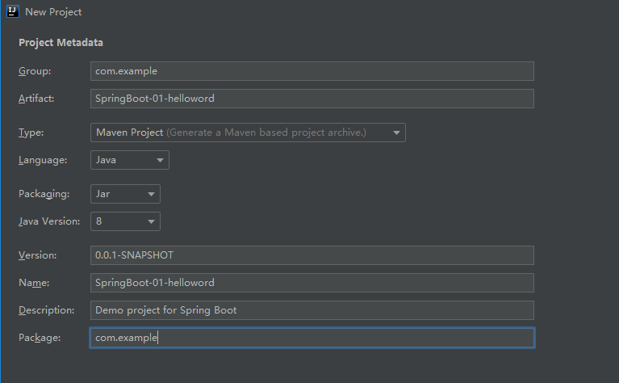

pom.xml中的配置：
- parent: 继承 ```spring-boot-starter-parent``` 的依赖管理，控制版本与打包等内容
- dependencies: 项目具体依赖，这里包含了 
  - ```spring-boot-starter-web``` 用于实现HTTP接口(该依赖中包含了Spring MVC)，官网对它的描述是:使用 Spring MVC 构建Web(包括RESTful)应用程序的入门者，使用Tomcat作为默认嵌入式容器。
  - ```spring -boot-starter-test``` 用于编写单元测试的依赖包。更多功能模块的使用我们将在后面逐步展开。
- build:构建配置部分。默认使用了 ```spring-boot-maven-plugin```，配合 ```spring-boot-starter-parent``` 就可以把 Spring Boot 应用打包成 JAR 来直接运行。

> #### 测试

在主程序即 xxxApplication 同级目录下新建一个包 controller【一定要在同级目录下，否则识别不到】。

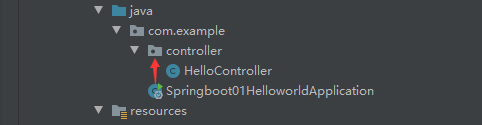

编写代码：
```java
@RestController
public class HelloController {

    // 接口： http://localhost:8080/hello/
    @RequestMapping("/hello")
    public String hello(){
        // 调用业务，接收前端参数
        return "Hello SpringBoot!";
    }
}
```

启动主程序，并在浏览器中输入：http://localhost:8080/hello/ 测试。

> 彩蛋

在 resources 目录下新建 banner.txt
再去 [bootschool](https://www.bootschool.net/ascii-art) 找ASCII艺术字（图）集写到 banner.txt
就可以修改 SpringBoot 的启动图标了


### 二、 原理初探

#### 1、 SpringBoot 自动装配原理：

**pom.xml**
 - spring-boot-dependencies : 核心依赖在父工程中
    - 我们在写或者引入一些 SpringBoot 依赖的时候，不需要指定版本，就是因为有这些版本仓库。


**启动器 :** 
```xml
<dependency>
  <groupId>org.springframework.boot</groupId>
  <artifactId>spring-boot-starter</artifactId>
</dependency>
```
- 说白了就是 SpringBoot 的启动场景。
- 比如 ```<artifactId>spring-boot-starter-web</artifactId>```： 就会帮我们自动导入 web 环境所有的依赖。
- SpringBoot 会将所有的功能场景，都变成一个个的启动器。
- 如果我们要使用什么功能，就只需要找到对应的启动器就可以了。 ["starter"](https://docs.spring.io/spring-boot/docs/current/reference/html/using-spring-boot.html#using-boot-starter)

**主程序**
```java
// @SpringBootApplication: 标注这个类是一个 SpringBoot 的应用。
 @SpringBootApplication
 public class Springboot01HelloworldApplication {

     public static void main(String[] args) {
         // 将 SpringBoot 启动
         SpringApplication.run(Springboot01HelloworldApplication.class, args);
     }
 }
```

- **注解（Ctrl + 鼠标左键 点入）**

=======================自行查阅==============================

> 注解的用途   
> 原文链接：https://blog.csdn.net/yuzongtao/article/details/83306182

在看注解的用途之前，有必要简单的介绍下XML和注解区别，
- 注解：是一种分散式的元数据，与源代码紧绑定。
- xml：是一种集中式的元数据，与源代码无绑定

当然网上存在各种XML与注解的辩论哪个更好，这里不作评论和介绍，主要介绍一下注解的主要用途:
- 生成文档，通过代码里标识的元数据生成javadoc文档。
- 编译检查，通过代码里标识的元数据让编译器在编译期间进行检查验证。
- 编译时动态处理，编译时通过代码里标识的元数据动态处理，例如动态生成代码。
- 运行时动态处理，运行时通过代码里标识的元数据动态处理，例如使用反射注入实例。

@Import  
@Import注解功能就是和Spring XML 里面 的 一样. @Import注解是用来导入配置类或者一些需要前置加载的类.

@Configuration  
从Spring3.0，@Configuration用于定义配置类，可替换xml配置文件，
被注解的类内部包含有一个或多个被@Bean注解的方法，这些方法将会被 
AnnotationConfigApplicationContext 或 AnnotationConfigWebApplicationContext 类进行扫描，
并用于构建bean定义，初始化Spring容器。

======================================================

- `@SpringBootApplication` ： 组合注解  
    - `@SpringBootConfiguration` : SpringBoot 的配置  
        - `@Configuration`  
            - `@Component` : 说明这也是一个 Spring 的组件  
    - `@EnableAutoConfiguration` ： 自动配置  
        - `@AutoConfigurationPackage` ： 自动配置包  
            - `@Import(AutoConfigurationPackages.Registrar.class)` ： 自动配置 `包注册`  
        - `@Import(AutoConfigurationImportSelector.class)` : 自动配置导入选择    
   - @ComponentScan : 扫描当前主启动类同级的包 


自动配置导入选择 : `AutoConfigurationImportSelector` 类下的 `selectImports()` 方法调用的 `getAutoConfigurationEntry()` 方法中：
```java
// 获取所有的配置。
List<String> configurations = getCandidateConfigurations(annotationMetadata, attributes); 
```
获取候选的配置
```java
protected List<String> getCandidateConfigurations(AnnotationMetadata metadata, AnnotationAttributes attributes) {
    List<String> configurations = SpringFactoriesLoader.loadFactoryNames(getSpringFactoriesLoaderFactoryClass(),
            getBeanClassLoader());
    Assert.notEmpty(configurations, "No auto configuration classes found in META-INF/spring.factories. If you "
            + "are using a custom packaging, make sure that file is correct.");
    return configurations;
}
```
META-INF/spring.factories : 自动配置的核心文件

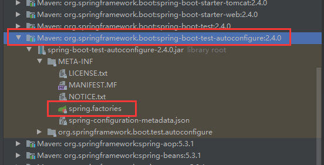

=========================================================== 

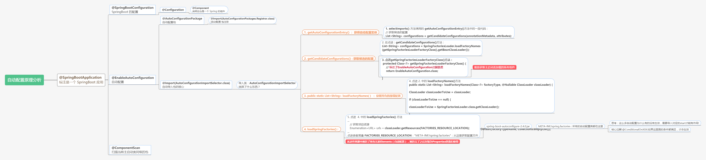


自动配置真正实现是从 `classpath` 中搜寻所有的 `META-INF/spring.factories` 配置文件，
并将其中对应的 `org.springframework.boot.autoconfigure`.包下的配置项，
通过反射实例化为对应标注了 `@Configuration` 的 JavaConfig 形式的IOC容器配置类，然后将这些都汇总成为一个实例并加载到IOC容器中。

**结论:**   
springboot 所有自动配置都是在启动的时候扫描并加载: spring.factories 所有的自动配置类都在这里面，
但是不一定生效:要判断条件是否成立，只要导入了对应的start，就有对应的启动器了，有了启动器，我们自动装配就会生效，然后就配置成功!

1. SpringBoot在启动的时候从类路径下的 META-INF/spring.factories 中获取 EnableAutoConfiguration 指定的值
2. 将这些值作为自动配置类导入容器，自动配置类就生效，帮我们进行自动配置工作;
3. 以前我们需要自己配置的东西，自动配置类都帮我们解决了
4. 整个J2EE的整体解决方案和自动配置都在 springboot-autoconfigure.jar 包中;
5. 它将所有需要导入的组件以全类名的方式返回，这些组件就会被添加到容器中;
6. 它会给容器中导入非常多的自动配置类(xxxAutoConfiguration)，就是给容器中导入这个场景需要的所有组件,并配置好这些组件. @Configuration > JavaConfig!
7. 有了自动配置类，免去了我们手动编写配置注入功能组件等的工作;


#### 2、 主启动类运行

```java
@SpringBootApplication
public class Springboot01HelloworldApplication {

    public static void main(String[] args) {
        // 该方法返回一个 configurableApplicationContext 对象
        // 参数一:应用入口的类 参数二:命令行参数
        SpringApplication.run(Springboot01HelloworldApplication.class, args);
    }
}
```
SpringApplication.run 分析分为两部分：一是 SpringApplication 实例化，二是 run 方法执行。

> SpringApplication

这个类主要做了以下四件事情
1. 推断应用的类型是普通的项目还是Web项目
2. 查找并加载所有可用初始化器，设置到initializers属性中
3. 找出所有的应用程序监听器，设置到listeners属性中
4. 推断并设置main方法的定义类,找到运行的主类


### 三、 yaml 语法

> #### 配置文件

SpringBoot 使用一个全局配置文件，配置文件名称是固定的
- application.properties
    - 语法结构 ： key=value
- application.yaml
    - 语法结构： key: 空格 value
**配置文件的作用：** 修改 SpringBoot 自动配置的默认值，因为 SpringBoot 在底层都给我们自动配置好了。

> #### yaml

YAML 是 "YAML Ain't a Markup Language"（YAML 不是一种标记语言）的递归缩写。
在开发的这种语言时，YAML 的意思其实是："Yet Another Markup Language"（仍是一种标记语言）。

标记语言：  
- yaml 配置
```yaml
server:
    port: 8080
```
- xml 配置
```xml
<server>
    <port>8080</port>
</server>
```

> #### yaml 基本语法

[YAML 入门教程](https://www.runoob.com/w3cnote/yaml-intro.html)

- 大小写敏感
- 使用缩进表示层级关系
- 缩进不允许使用tab，只允许空格
- 缩进的空格数不重要，只要相同层级的元素左对齐即可
- '#'表示注释

**1、 对象**
```yaml
# 对象
# 1. 对象键值对使用冒号结构表示 key: value，冒号后面要加一个空格。
student:
  name: 'mianbao'
  age: 3

# 2. 也可以使用 key:{key1: value1, key2: value2, ...}。
student: {name: 'mianbao', age: 3}
```

**2、 数组**
```yaml
# 数组
# 1. 以 - 开头的行表示构成一个数组
pets:
  - cat
  - dog
  - pig

# 2. 可以使用行内表示：key: [value1, value2, ...]
pets: [cat, dog, pig]
```

**3、 纯量**
```yaml
#  纯量
# 纯量是最基本的，不可再分的值，包括：字符串、布尔值、整数、浮点数、Null、时间、日期
boolean:
  - TRUE  #true,True都可以
  - FALSE  #false，False都可以
float:
  - 3.14
  - 6.8523015e+5  #可以使用科学计数法
int:
  - 123
  - 0b1010_0111_0100_1010_1110    #二进制表示
null:
  nodeName: 'node'
  parent: ~  #使用~表示null
string:
  - 哈哈
  - 'Hello world'  #可以使用双引号或者单引号包裹特殊字符
  - newline
    newline2    #字符串可以拆成多行，每一行会被转化成一个空格
date:
  - 2018-02-17    #日期必须使用ISO 8601格式，即yyyy-MM-dd
datetime:
  -  2018-02-17T15:02:31+08:00    #时间使用ISO 8601格式，时间和日期之间使用T连接，最后使用+代表时区
```


### 四、给属性赋值的几种方式

**yaml 可以直接给实体类赋值**  
Dog:
```java
@Component
public class Dog {
    private String name;
    private Integer age;
    // getter and setter
}
```
Person:
```java
@Component
public class Person {
    private String name;
    private Integer age;
    private Boolean happy;
    private Date birth;
    private Map<String, Object> maps;
    private List<Object> lists;
    private Dog dog;
    // getter and setter
}
```


- #### **1. 原来的注解赋值方式：**
```java
// 实体类
@Component
public class Dog {
    @Value("旺财")
    private String name;
    @Value("5")
    private Integer age;

    // getter and setter
}

// 测试类
@SpringBootTest
class Springboot02ConfigApplicationTests {

    @Autowired
    private Dog dog;

    @Test
    void contextLoads() {
        System.out.println(dog);
    }
}
```

- #### **2. 使用 yaml：**  
application.yaml:  
```yaml
person:
  name: miaobao
  age: 3
  happy: false
  birth: 2020/11/23
  maps: {k1: v1, k2: v2}
  lists:
    - code
    - music
    - girl
  dog:
    name: 旺财
    age: 3
```

实体类使用注解：@ConfigurationProperties(prefix = "person")
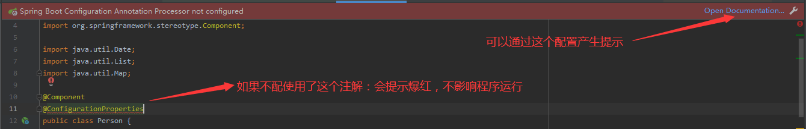

解决，引入依赖：
```xml
<dependency>
    <groupId>org.springframework.boot</groupId>
    <artifactId>spring-boot-configuration-processor</artifactId>
</dependency>
```

**@ConfigurationProperties作用:**  
- 将配置文件中配置的每一个属性的值，映射到这个组件中;
- 告诉 springBoot 将本类中的所有属性和配置文件中相关的配置进行绑定
- 参数 prefix = "person": 将配置文件中的 person 下面的所有属性—─对应
- 只有这个组件是容器中的组件，才能使用容器提供的 @ConfigurationProperties 功能

- #### **3. 使用 properties 文件**
mianbao.properties
```properties
name=mianbao
```
Person 类：
```java
@Component
// 加载指定的配置文件
@PropertySource(value = "classpath:mianbao.properties")
public class Person {

    // 使用 SPEL 取出配置文件的值
    @Value("${name}")
    private String name;
..........
```


#### **JavaConfig 绑定配置文件的值，可以采取以上方式！**
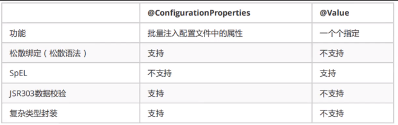


- 如果我们在某个业务中，只需要获取配置文件中的某个值，可以使用一下@value
- 如果说，我们专门编写了一个JavaBean来和配置文件进行映射，就直接使用@configurationProperties!

#### yaml 配置随机值
它可以生成整数，长整数，uuids或字符串
```yaml
person:
  name: miaobao${random.uuid}
```

#### yaml 的松散绑定
这个什么意思呢?比如我的yml中写的last-name，这个和lastName是一样的，-后面跟着的字母默认是大写的。这就是松散绑定。
```yaml
dog:
  first-name: 阿黄
  age: 3
```
```java
@Component
@ConfigurationProperties(prefix = "dog")
public class Dog {
    private String firstName;
    private Integer age;
    ...
}
```


#### JSR-303数据校验
这个就是我们可以在字段是增加一层过滤器验证，可以保证数据的合法性复杂类型封装，yml中可以封装对象，使用@value就不支持。

需要带入依赖：
```xml
<dependency>
    <groupId>org.springframework.boot</groupId>
    <artifactId>spring-boot-starter-validation</artifactId>
</dependency>
```

类上面配置 @Validated 注解，需要校验的参数配置上对应的注解，当方法被调用的时候自动对参数校验，如果校验的结果不通过就抛出异常，会打印配置的message的内容。

```java
@Component
@ConfigurationProperties(prefix = "person")
@Validated // 数据校验
public class Person {

    @Email(message = "邮箱格式不正确")
    private String name;
   .....
}
```
**校验规则:**
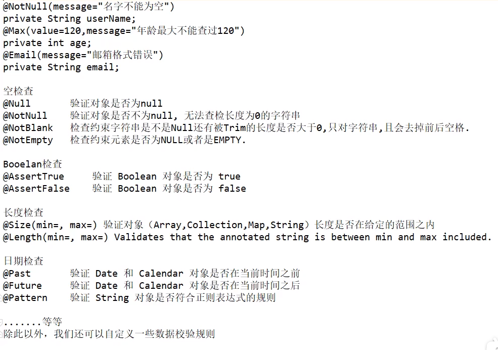


### 五、配置文件位置和多环境配置
#### 配置文件位置
> SpringBoot版本： 2.4.0

测试时优先级：
1. 根目录下的：/config/application.yaml
2. 根目录下的：/application.yaml
3. classpath: /config/application.yaml
4. classpath: /application.yaml
```yaml
server:
  port: 808X # 8081 8082 8083 8084
```

[官方文档的优先级](https://docs.spring.io/spring-boot/docs/current/reference/html/spring-boot-features.html#boot-features-external-config-files)？？？
1. The classpath root
2. The classpath /config package
3. The current directory
4. The /config subdirectory in the current directory
5. Immediate child directories of the /config subdirectory

#### 多环境配置

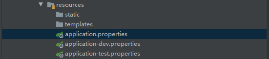

application.properties 通过以下配置激活(通过后缀)：
```properties
# SpringBoot 多环境配置，可以选择激活哪一个配置文件
spring.profiles.active=test
```

yaml 格式的多环境配置
```yaml
server:
  port: 8081
spring:
  profiles:
    active: test

# dev 环境
---  # 分隔符
server:
  port: 8082
spring:
  profiles: dev

# test 环境
---
server:
  port: 8083
spring:
  profiles: test
```


### 七、 自动配置原理再理解

SpringBoot 配置文件到底能写什么----联系---- META-INF/spring.factories（自动配置的核心文件）

META-INF/spring.factories 里面的 org.springframework.boot.autoconfigure.web.servlet.HttpEncodingAutoConfiguration 点进去
```java
// 标注这是一个配置类
@Configuration(proxyBeanMethods = false)

// 自动配置属性 : ServerProperties
@EnableConfigurationProperties(ServerProperties.class)

// ConditionalOnXXX : Spring 的底层注解，来判断当前配置或者类是否生效！
@ConditionalOnWebApplication(type = ConditionalOnWebApplication.Type.SERVLET)
@ConditionalOnClass(CharacterEncodingFilter.class)
@ConditionalOnProperty(prefix = "server.servlet.encoding", value = "enabled", matchIfMissing = true)
public class HttpEncodingAutoConfiguration {

	private final Encoding properties;

	public HttpEncodingAutoConfiguration(ServerProperties properties) {
		this.properties = properties.getServlet().getEncoding();
	}

	....
}
```

点进自动配置属性类：ServerProperties, 发现和配置文件里可以配置字段和类 `ServerProperties` 里属性 相符合。

xxxAutoConfiguration ：自动装配从 xxxProperties类 中获取的默认值。  
xxxProperties类 和 配置文件 绑定 ，我们就可以使用配置文件进行自定义配置了。


#### @EnableConfigurationProperties 注解
使用@ConditionalOnProperty注解来控制@Configuration是否生效.
例子：
```java
@Configuration
@ConditionalOnProperty(prefix = "filter",name = "loginFilter",havingValue = "true")
public class FilterConfig {
...
}
```
配置文件中的代码
```properties
filter.loginFilter=true
```
配置类生效。

#### @Conditional 注解
- 标注在类上面，表示该类下面的所有 @Bean 都会启用配置
- 标注在方法上面，只是对该方法启用配置

> @ConditionalOnXXX

自动配置类必须在一定条件下才能生效.
作用：必须是 @ConditionalOn 指定的条件成立，才能给容器中添加组件，配置里面的所有内容才会生效
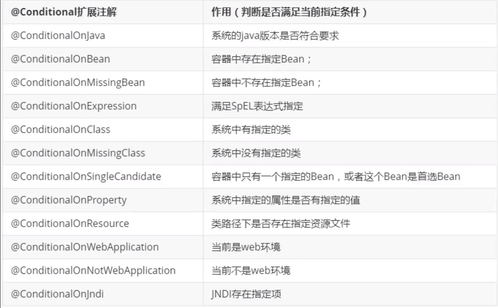


**这就是自动装配的原理!**  
1)、SpringBoot 启动会加载大量的自动配置类  
2)、我们看我们需要的功能有没有在 SpringBoot 默认写好的自动配置类当中;   
3)、我们再来看这个自动配置类中到底配置了哪些组件;(只要我们要用的组件存在在其中，我们就不需要再手动配置了)  
4)、给容器中自动配置类添加组件的时候，会从 properties类 中获取某些属性。我们只需要在配置文件中指定这些属性的值即可;

   - **xxxxAutoConfigurartion: 自动配置类**： 给容器中添加组件  
   - **xxxxProperties: 封装配置文件中相关属性**

**可以通过此配置，来查看哪些自动配置类生效，哪些自动配置类没有生效**


## SpringBoot Web 开发
### 静态资源

打开 WebMvcAutoConfiguration 类里面的静态类 WebMvcAutoConfigurationAdapter 里面的 addResourceHandlers() 方法
```java
@Override
public void addResourceHandlers(ResourceHandlerRegistry registry) {
    // 有没有自定义配置
    if (!this.resourceProperties.isAddMappings()) {
        logger.debug("Default resource handling disabled");
        return;
    }

    Duration cachePeriod = this.resourceProperties.getCache().getPeriod();
    CacheControl cacheControl = this.resourceProperties.getCache().getCachecontrol().toHttpCacheControl();
    
    // 1. WebJars 方式， 只需要输入 /webjars/**
    if (!registry.hasMappingForPattern("/webjars/**")) {
        customizeResourceHandlerRegistration(registry.addResourceHandler("/webjars/**")
                .addResourceLocations("classpath:/META-INF/resources/webjars/")
                .setCachePeriod(getSeconds(cachePeriod)).setCacheControl(cacheControl)
                .setUseLastModified(this.resourceProperties.getCache().isUseLastModified()));
    }

    // 2. 获得静态资源的路径
    String staticPathPattern = this.mvcProperties.getStaticPathPattern();
    if (!registry.hasMappingForPattern(staticPathPattern)) {
        customizeResourceHandlerRegistration(registry.addResourceHandler(staticPathPattern)
                .addResourceLocations(getResourceLocations(this.resourceProperties.getStaticLocations()))
                .setCachePeriod(getSeconds(cachePeriod)).setCacheControl(cacheControl)
                .setUseLastModified(this.resourceProperties.getCache().isUseLastModified()));
    }
}
```

**1、 WebJars** (一般不使用)   

[WebJars 官网](https://www.webjars.org/)  

访问资源路径： /webjars/**  映射到 classpath:/META-INF/resources/webjars/  
访问路径：`http://localhost:8080/webjars/**`

> 测试

可以使用Maven 引入 JQuery.
```xml
<dependency>
    <groupId>org.webjars</groupId>
    <artifactId>jquery</artifactId>
    <version>3.5.1</version>
</dependency>
```
如果你要访问 jquery 相当于你只要输入 ： http://localhost:8080/webjars/jquery/3.5.1/jquery.js 就可以访问到。  

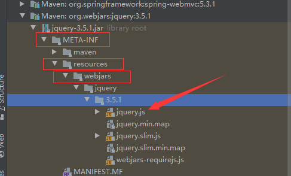

**2、 获得静态资源路径**  

getStaticPathPattern() 码源为：
```java
public String getStaticPathPattern() {
     return this.staticPathPattern;
 }
// 点进 staticPathPattern
/**
 * Path pattern used for static resources.
 */
private String staticPathPattern = "/**";
```
WebMvcAutoConfiguration 类里面的静态类 WebMvcAutoConfigurationAdapter类码源：
```java
@EnableConfigurationProperties({ WebMvcProperties.class,
        org.springframework.boot.autoconfigure.web.ResourceProperties.class, WebProperties.class })
public static class WebMvcAutoConfigurationAdapter implements WebMvcConfigurer {
    ....
}

// 点进 WebProperties 配置类
@ConfigurationProperties("spring.web")
public class WebProperties {
    public static class Resources {

        private static final String[] CLASSPATH_RESOURCE_LOCATIONS = { "classpath:/META-INF/resources/",
                "classpath:/resources/", "classpath:/static/", "classpath:/public/" };

        /**
         * Locations of static resources. Defaults to classpath:[/META-INF/resources/,
         * /resources/, /static/, /public/].
         */
        private String[] staticLocations = CLASSPATH_RESOURCE_LOCATIONS;
    }
}
```

访问资源路径：/**  映射到  "classpath:/META-INF/resources/", "classpath:/resources/", "classpath:/static/", "classpath:/public/"   
这4个目录都能够被识别到

  访问路径：`http://localhost:8080/**`

 **优先级： public < static(默认) < resources**


**3、 自定义配置**  (一般不配置，使用第二种默认的)  
application.properties
```properties
spring.mvc.static-path-pattern=/xxxx
```


### 首页

EnableWebMvcConfiguration 类的内部类 EnableWebMvcConfiguration 码源：
```java
@Bean
public WelcomePageHandlerMapping welcomePageHandlerMapping(ApplicationContext applicationContext,
        FormattingConversionService mvcConversionService, ResourceUrlProvider mvcResourceUrlProvider) {
    WelcomePageHandlerMapping welcomePageHandlerMapping = new WelcomePageHandlerMapping(
            new TemplateAvailabilityProviders(applicationContext), applicationContext, getWelcomePage(),
            this.mvcProperties.getStaticPathPattern());// this.mvcProperties.getStaticPathPattern() 获取自定义的配置
    welcomePageHandlerMapping.setInterceptors(getInterceptors(mvcConversionService, mvcResourceUrlProvider));
    welcomePageHandlerMapping.setCorsConfigurations(getCorsConfigurations());
    return welcomePageHandlerMapping;
}

    ....

private Optional<Resource> getWelcomePage() {
    // this.resourceProperties.getStaticLocations() 点进去是系统定义的4个静态资源目录
    String[] locations = getResourceLocations(this.resourceProperties.getStaticLocations()); 
    return Arrays.stream(locations).map(this::getIndexHtml).filter(this::isReadable).findFirst();
}

private Resource getIndexHtml(String location) {
    // 在静态资源目录下找 index.html ，返回首页
    return this.resourceLoader.getResource(location + "index.html");
}
```

所以将 index.html 放在静态资源目录下即可直接访问到。

在 templates 目录下的所有页面，只能通过 Controller 来跳转。需要模板引擎的支持。（thymeleaf）


### Thymeleaf 模板引擎

#### 什么是 Thymeleaf ?
Thymeleaf是适用于Web和独立环境的现代服务器端Java模板引擎，能够处理HTML，XML，JavaScript，CSS甚至纯文本。
jsp 就是一个模板引擎。

[Thymeleaf 官网](https://www.thymeleaf.org/) : https://www.thymeleaf.org/  
[Thymeleaf Github](https://github.com/thymeleaf) : https://github.com/thymeleaf  
[SpringBoot Start](https://docs.spring.io/spring-boot/docs/current/reference/html/using-spring-boot.html#using-boot-starter)

**需要带入依赖：**
```xml
<!-- Thymeleaf : 基于 3.x 开发 -->
<dependency>
    <groupId>org.springframework.boot</groupId>
    <artifactId>spring-boot-starter-thymeleaf</artifactId>
</dependency>
```

导入的东西都有 xxxProperties 自动配置类，查看 Thymeleaf 的自动配置类：ThymeleafProperties 的源码：
```java
@ConfigurationProperties(prefix = "spring.thymeleaf")
public class ThymeleafProperties {
	private static final Charset DEFAULT_ENCODING = StandardCharsets.UTF_8;
        // 默认前缀
	public static final String DEFAULT_PREFIX = "classpath:/templates/";
        // 默认后缀
	public static final String DEFAULT_SUFFIX = ".html";
        ...
}
```
测试在 templates 目录下新建 test.html, 编写 Controller:
```java
@Controller
public class IndexController {
    @RequestMapping("/test")
    public String index(){
        return "test";
    }
}
```
输入 http://localhost:8080/test 即可访问到。


#### Thymeleaf 基础语法 (另外再自学吧，淦！)
所有的 html 元素都可以被 thymeleaf 替换接管： th:元素名

> 导入命名空间
```html
<html xmlns:th="http://www.thymeleaf.org">
```

**属性优先级：**  

 Order  | Feature | Attributes |
:------:|:----------------------------|:-----------------------
1       | Fragment inclusion                  | th:insert、th:replace 
2       | Fragment iteration                  | th:each
3       | Conditional evaluation              | th:if、th:unless、th:switch、th:case
4       | Local variable definition           |	th:object、th:with
5       | General attribute modification      | th:attr、th:attrprepend、th:attrappend
6       | Specific attribute modification     | th:value、th:href、th:src、...
7	    | Text (tag body modification)	      | th:text、th:utext
8	    | Fragment specification	          | th:fragment
9	    | Fragment removal	                  | th:remove


**1、 简单变量**
- 变量表达式: ${...}
```html
<div th:text="${msg}"></div>
```
- 选择表达式: *{...}
```html
<div th:object="${session.user}">
    <p>Name: <span th:text="*{name}"></span></p>
    <p>Age: <span th:text="*{age}"></span></p>
    <p>Sex: <span th:text="*{sex}"></span></p>
</div>
<!-- 等价于 -->
<div>
    <p>Name: <span th:text="${session.user.name}"></span></p>
    <p>Age: <span th:text="${session.user.age}"></span></p>
    <p>Sex: <span th:text="${session.user.sex}"></span></p>
</div>
```
- 消息表达式: #{...}  
   用于国际化
   
- 链接表达式: @{...}
```html
<a th:href="@{test.html}">Content 路径,默认访问静态资源目录下的文件</a>
```
- 片段表达式: ~{...} (模板插入： th:insert, th:replace)

```html
<!--侧边栏-->
<nav th:fragment="sidebarMenu">...</nav>

<!-- 侧边栏插入 -->
<div th:insert="~{文件名::sidebarMenu}"></div>
```

```html
templates/conmons/commons.html 
<nav th:fragment="sidebarMenu">...</nav>
    
<!-- 使用界面的侧边栏引入 -->
<div th:replace="~{commons/commons::sidebarMenu}"></div>
```

**2、 文字**
- 文本文字（单引号）: 'one text', 'Another one!',…
- 数字: 0, 34, 3.0, 12.3,…
- 布尔值: true, false
- 空值: null

**3、 文本操作:**
- 文本连接符: +
- 文本替换  : |The name is ${name}|

**4、比较运算符:**
- 比较: >, <, >=, <= (gt, lt, ge, le)
- 相等: ==, != (eq, ne)

**5、条件运算符:**
- If-then: (if) ? (then)
- If-then-else: (if) ? (then) : (else)
- Default: (value) ?: (defaultvalue)

**6、 循环**
th:each 
```html
<tr th:each="user,iterStat : ${users}">
    <td th:text="${user.name}"></td>
    <td th:text="${user.age}"></td>
    <td th:text="${user.sex}"></td>
</tr>
```
iterStat 对象包含以下属性：
- index，从0开始的角标
- count，元素的个数，从1开始
- size，总元素个数
- current，当前遍历到的元素
- even/odd，返回是否为奇偶，boolean值
- first/last，返回是否为第一或最后，boolean值


### MVC 配置原理

[官方文档](https://docs.spring.io/spring-boot/docs/current/reference/html/spring-boot-features.html#boot-features-developing-web-applications)

Spring Boot为Spring MVC提供了自动配置，适用于大多数应用程序。  
自动配置在 Spring 的默认值之上添加了以下功能：
- 包含 `ContentNegotiatingViewResolver` 和 `BeanNameViewResolver` beans。
- 支持提供静态资源，包括对 WebJars 的支持。
- 自动注册 `Converter`，`GenericConverter` 和 `Formatter` beans。
- 支持 `HttpMessageConverters`。
- 自动注册 `MessageCodesResolver`。
- 静态 `index.html` 支持。
- 自动使用 `ConfigurableWebBindingInitializer` bean。

如果你想保留 Spring Boot MVC 功能，并且你想添加额外的 MVC 配置（拦截器，格式化程序，视图控制器和其他功能），
你可以编写自己 MVC配置类 添加上 `@Configuration`注解，并且这个配置类的类型必须为 `WebMvcConfigurer`类(他是一个接口类，实现即可) 但不加 `@EnableWebMvc`注解。

如果您想完全控制 Spring MVC，可以添加注释 `@EnableWebMvc`。

#### 初体验

自定义一个视图解析器
```java
// 扩展 Spring MVC
@Configuration
public class MyNvcConfig implements WebMvcConfigurer {
    // ContentNegotiatingViewResolver ——> ViewResolver 实现了视图解析器接口，我们就可以把他看做视图解析器

    // 放入到 Spring 容器中
    @Bean
    public ViewResolver myViewResolver(){
        return new MyViewResolver();
    }
    // 自定义一个视图解析器 MyViewResolver
    public static class MyViewResolver implements ViewResolver {

        @Override
        public View resolveViewName(String viewName, Locale locale) throws Exception {
            return null;
        }
    }
}
```

所有的请求都会经过 `DispatcherServlet` 类，在此类源码的一下方法打上断点。 debug 启动 SpringBoot 
```java
protected void doDispatch(HttpServletRequest request, HttpServletResponse response)
```
可以看到自己写的视图解析器配置类：

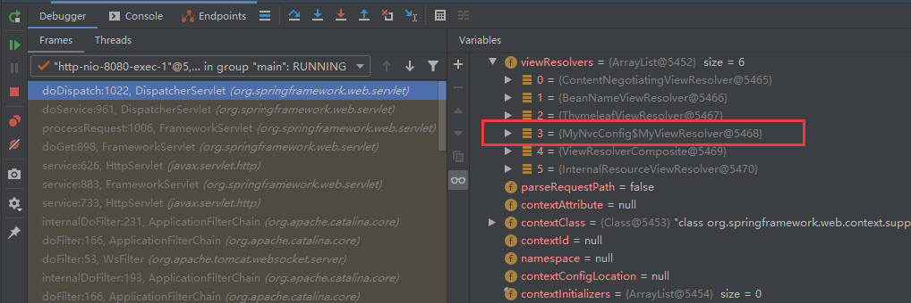

如果需要自定义一些功能，只需要写组件，然后将它交给 SpringBoot，SpringBoot会帮我们自动装配。


### 首页跳转实现
输入：`http://localhost:8080/index.html`、`http://localhost:8080/` 都会跳转到 index.html
```java
@Configuration
public class MyMvcConfig implements WebMvcConfigurer {
    @Override
    public void addViewControllers(ViewControllerRegistry registry) {
        // 首页跳转实现
        registry.addViewController("/").setViewName("index");
        registry.addViewController("/index.html").setViewName("index");
    }
}
```


### 国际化
在 static 目录下新建 i18n（internationalization的缩写，中间有18个字母） 文件夹，新建 login.properties 文件，再建一个 login_zh_CN.properties 文件
IDEA 会自动生成 Resource Bundle 'login' 文件夹，右击可以新建其他语言的配置文件

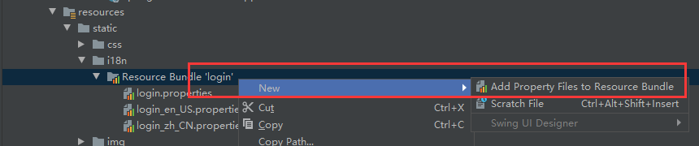

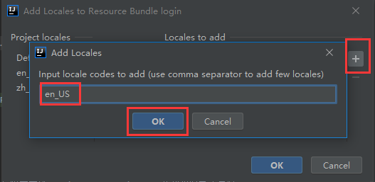

打开某个配置文件，点击编辑器底部的 Resource Bundle ，即可同时编写三个文件。

自动配置类：`MessageSourceAutoConfiguration`  
配置文件：

```properties
# 国际化配置文件位置
spring.messages.basename=i18n.login
```

html: 使用 Thymeleaf 的 #{xxx} 获取，链接传递的参数：@{/index.html(l='zh_CN')}
```html
<body class="text-center">
<form class="form-signin">
  
  <h1 class="h3 mb-3 font-weight-normal" th:text="#{login.tip}">Please sign in</h1>
  <label for="inputEmail" class="sr-only" th:text="#{login.username}">Username</label>
  <input type="text" id="inputEmail" class="form-control" th:placeholder="#{login.username}" required autofocus>
  <label for="inputPassword" class="sr-only" th:text="#{login.password}">Password</label>
  <input type="password" id="inputPassword" class="form-control" th:placeholder="#{login.password}" required>
  <div class="checkbox mb-3">
    <label>
      <input type="checkbox" value="remember-me" th:text="#{login.remember}">
    </label>
  </div>
  <button class="btn btn-lg btn-primary btn-block" type="submit" th:text="#{login.btn}">Sign in</button>
  <p class="mt-5 mb-3 text-muted">&copy; 2017-2020</p>
  <a class="btn btn-sm" th:href="@{/index.html(l='zh_CN')}">中文</a>
  <a class="btn btn-sm" th:href="@{/index.html(l='en_US')}">English</a>
</form>
</body>
```


如果需要按钮进行切换，需要自定义一个组件：`MyLocaleResolver`

```java
public class MyLocaleResolver implements LocaleResolver {
    // 解析请求
    @Override
    public Locale resolveLocale(HttpServletRequest request) {
        // 获得请求的语言参数
        String language = request.getParameter("l");

        Locale locale = Locale.getDefault(); // 如果没有，就是用默认的
        // 如果请求的连接携带了国际化的参数
        if (!StringUtils.isEmpty(language)){
            // zh_CN
            String[] split = language.split("_");
            // 国家，地区
            locale = new Locale(split[0], split[1]);
        }
        return locale;
    }

    @Override
    public void setLocale(HttpServletRequest request, HttpServletResponse response, Locale locale) {}
}
```

将自己的组件注册到 Spring 容器中： @Bean

```java
// MyMvcConfig.java
// 注入Bean 自定义国际化组件
@Bean
public LocaleResolver localeResolver(){
    return new MyLocaleResolver();
}
```


### 登录功能实现

html :

```html
<form class="form-signin" th:action="@{/user/login}" method="post">
    ...
    <h1 class="h3 mb-3 font-weight-normal" th:text="#{login.tip}">Please sign in</h1>
  	<!-- 如果msg不为空则显示 -->
  	<p style="color: red;" th:text="${msg}" th:if="${not #strings.isEmpty(msg)}"></p>
    ...
</form>
```

LopginController:

```java
@Controller
public class LoginController {

    @RequestMapping("/user/login")
    public String login(
            @RequestParam("username") String username,
            @RequestParam("password") String password,
            Model model,
    		HttpSession session){

        // 具体业务
        if (!StringUtils.isEmpty(username) && "123".equals(password)){
            session.setAttribute("loginUser", username);
            return "redirect:/main.html";
        }else {
            // 告诉用户，登录失败
            model.addAttribute("msg", "用户或密码错误！");
            return "index";
        }
    }
}
```

路径映射：`MyMvcConfig` 的 `addViewControllers()` 方法 （重定向到 /main.html 会跳转到 dashboard.html 这个模板）

```java
@Configuration
public class MyMvcConfig implements WebMvcConfigurer {
    @Override
    public void addViewControllers(ViewControllerRegistry registry) {
		...
        registry.addViewController("/main.html").setViewName("dashboard");
    }
}
```


### 登录拦截器

编写登录拦截器： `LoginHandlerInterceptor`

```java
public class LoginHandlerInterceptor implements HandlerInterceptor {

    @Override
    public boolean preHandle(HttpServletRequest request, HttpServletResponse response, Object handler) throws Exception {
        // 登录成功之后应该有用户的 session
        Object loginUser = request.getSession().getAttribute("loginUser");

        // 没有登录
        if (loginUser == null){
            request.setAttribute("msg", "没有权限，请先登录！");
            request.getRequestDispatcher("/index.html").forward(request, response);
            return false;
        } else {
            return true;
        }
    }
}
```

配置中注册拦截器：`MyMvcConfig`

```java
@Override
public void addInterceptors(InterceptorRegistry registry) {
    registry.addInterceptor(new LoginHandlerInterceptor())
        .addPathPatterns("/**")
        .excludePathPatterns("/index.html", "/", "/user/login",
                             "/js/**",      // js静态资源
                             "/css/**",     // css静态资源
                             "/img/**"      // img静态资源
                            );
}
```

### Thymeleaf代码复用

templates/conmons/commons.html 存放模板代码, 使用 `th:fragment="id"` 进行标记。

```html
<nav th:fragment="topBar">...</nav>
```

templates/xxx.html 使用时,使用 `th:replace="~{路径::id}"` 进行引用。

```html
<!-- 项目导航栏 -->
<div th:replace="~{commons/commons::topBar}"></div>
```

如果需要传递参数，可以直接使用 `()` 传参，接收判断

```html
<!-- 传递参数给组件 -->
<div th:replace="~{commons/commons::sidebarMenu(active='main.html')}"></div>

<!-- 接收判断 -->
<a th:class="${active=='main.html'? 'nav-link active' : 'nav-link'}" th:href="@{/index.html}">...</a>
```

员工列表循环显示：

```html
<thead>
    <tr>
        <th>id</th>
        <th>lastName</th>
        <th>email</th>
        <th>gender</th>
        <th>department</th>
        <th>birth</th>
        <th>操作</th>
    </tr>
</thead>
<tbody>
    <tr th:each="emp: ${employees}">
        <td th:text="${emp.getId()}"></td>
        <td th:text="${emp.getLastName()}"></td>
        <td th:text="${emp.getEmail()}"></td>
        <td th:text="${emp.getGender()==0 ? '女' : '男' }"></td>
        <td th:text="${emp.getDepartment().getName()}"></td>
        <td th:text="${#dates.format(emp.getBirth(), 'yyyy-MM-dd HH:mm:ss')}"></td>
        <td>
            <button class="btn btn-sm btn-primary">编辑</button>
            <button class="btn btn-sm btn-danger">删除</button>
        </td>
    </tr>
</tbody>
</table>
```


-----
**停了超长时间，继续都摸不着头脑了**

1、添加员工

```html
<form th:action="@{/emp}" method="post">
    <div class="form-group">
        <label>LastName</label>
        <input name="lastName" type="text" class="form-control" placeholder="面包">
    </div>
    <div class="form-group">
        <label>Email</label>
        <input name="email" type="email" class="form-control" placeholder="1752196851@qq.com">
    </div>
    <div class="form-group">
        <label>Gender</label><br>
        <div class="form-check form-check-inline">
            <input class="form-check-input" type="radio" name="gender" value="1">
            <label class="form-check-label">男</label>
        </div>
        <div class="form-check form-check-inline">
            <input class="form-check-input" type="radio" name="gender" value="0">
            <label class="form-check-label">女</label>
        </div>
    </div>
    <div class="form-group">
        <label>department</label>
        <!-- 我们在 controller 接收的是一个 Employee，所以我们需要提交的是其中的一个属性! department.id -->
        <select class="form-control" name="department.id">
            <option th:each="dept:${departments}" th:text="${dept.getName()}" th:value="${dept.getId()}"></option>
        </select>
    </div>
    <div class="form-group">
        <label>Birth</label>
        <input name="birth" type="text" class="form-control" placeholder="2020/12/01">
    </div>
    <button type="submit" class="btn btn-primary">添加</button>
</form>
```

2、修改员工：

```html
<form th:action="@{/updateEmp}" method="post">
    <!-- id隐藏域 -->
    <input type="hidden" name="id" th:value="${emp.getId()}">
    <div class="form-group">
        <label>LastName</label>
        <input th:value="${emp.getLastName()}" name="lastName" type="text" class="form-control" placeholder="面包">
    </div>
    <div class="form-group">
        <label>Email</label>
        <input th:value="${emp.getEmail()}" name="email" type="email" class="form-control" placeholder="1752196851@qq.com">
    </div>
    <div class="form-group">
        <label>Gender</label><br>
        <div class="form-check form-check-inline">
            <input th:checked="${emp.getGender()==1}" class="form-check-input" type="radio" name="gender" value="1">
            <label class="form-check-label">男</label>
        </div>
        <div class="form-check form-check-inline">
            <input th:checked="${emp.getGender()==0}" class="form-check-input" type="radio" name="gender" value="0">
            <label class="form-check-label">女</label>
        </div>
    </div>
    <div class="form-group">
        <label>department</label>
        <!-- 我们在 controller 接收的是一个 Employee，所以我们需要提交的是其中的一个属性! department.id -->
        <select class="form-control" name="department.id">
            <option th:selected="${dept.getId()==emp.getDepartment().getId()}" th:each="dept:${departments}" th:text="${dept.getName()}" th:value="${dept.getId()}"></option>
        </select>
    </div>
    <div class="form-group">
        <label>Birth</label>
        <input th:value="${#dates.format(emp.getBirth(), 'yyyy-MM-dd HH:mm')}" name="birth" type="text" class="form-control" placeholder="2020/12/01">
    </div>
    <button type="submit" class="btn btn-primary">修改</button>
</form>
```

配置文件日期格式：

```properties
# 日期格式化
spring.mvc.format.date=yyyy-MM-dd
```

3、删除员工：

```html
<a class="btn btn-sm btn-danger" th:href="@{/deleteEmp/}+${emp.getId()}">删除</a>
```

4、404页面

​	在templates文件夹下新建error文件夹，放置404.html、500.html等等即可。


## SpringBoot 学习笔记

无论是关系型数据库还是非关系型数据库，**Spring Boot **底层都是采用 **[Spring Data](https://www.bilibili.com/video/BV1PE411i7CV?p=31)** 的方式统一进行处理。

### 一、整合 JDBC 使用

**1、**新建 SpringBoot 项目，还要导入 **Web** 依赖


**2、**新建yaml配置文件: **application.yml**

```yaml
spring:
  datasource:
    username: 'root'
    password: ''
    url: jdbc:mysql://localhost:3306/mybatis?useUnicode=true&characterEncoding=UTF-8&serverTimezone=Asia/Shanghai
    driver-class-name: com.mysql.cj.jdbc.Driver
```

**3、**使用 SpringBoot 单元测试进行测试：

```java
@SpringBootTest
class Springboot05DataApplicationTests {

    @Autowired
    DataSource dataSource;

    @Test
    void contextLoads() throws SQLException {
        // 查看一下默认的数据源
        System.out.println(dataSource.getClass());
        // 获得数据库连接
        Connection connection = dataSource.getConnection();
        System.out.println(connection);

        // xxxTemplate ： SpringBoot 已经配置好的 Bean，拿来即用

        // 关闭数据库连接
        connection.close();
    }
}
```


新建一个 **controller** 进行测试：

```java
@RestController
public class JDBCController {

    @Autowired
    JdbcTemplate jdbcTemplate;

    // 查询数据库的所有信息
    // 没有实体类，使用 Map 获取信息
    @GetMapping("/userList")
    public List<Map<String, Object>> userList(){
        String sql = "select * from user";
        List<Map<String, Object>> list_maps = jdbcTemplate.queryForList(sql);
        return list_maps;
    }

    // 可以实现增删改查
    @GetMapping("/updateUser/{id}") 	// 访问地址：http://localhost:8080/updateUser/id
    public String updateUser(@PathVariable("id")Integer id){
        String sql = "update mybatis.user set name=?, pwd=? where id=" + id;
        // 封装
        Object[] objects = new Object[2];
        objects[0] = "面包+";
        objects[1] = "aaaaa";
        jdbcTemplate.update(sql, objects);

        return "Update-Ok";
    }
}
```


### 二、整合 Druid 数据源

#### 1、[简介](https://www.oschina.net/p/druid?hmsr=aladdin1e1)

**Druid 是一个JDBC组件，它包括三部分：** 

- DruidDriver 代理Driver，能够提供基于Filter－Chain模式的插件体系。 
- DruidDataSource 高效可管理的数据库连接池。 
- SQLParser 

**Druid可以做什么？** 

1) 可以监控数据库访问性能，Druid内置提供了一个功能强大的StatFilter插件，能够详细统计SQL的执行性能，这对于线上分析数据库访问性能有帮助。 

2) 替换[DBCP](http://www.oschina.net/p/dbcp)和[C3P0](http://www.oschina.net/p/c3p0)。Druid提供了一个高效、功能强大、可扩展性好的数据库连接池。 

3) 数据库密码加密。直接把数据库密码写在配置文件中，这是不好的行为，容易导致安全问题。DruidDruiver和DruidDataSource都支持PasswordCallback。 

4) SQL执行日志，Druid提供了不同的LogFilter，能够支持[Common-Logging](http://www.oschina.net/p/commons+logging)、[Log4j](http://www.oschina.net/p/log4j)和JdkLog，你可以按需要选择相应的LogFilter，监控你应用的数据库访问情况。 

#### 2、使用

导入依赖

```xml
<!-- https://mvnrepository.com/artifact/com.alibaba/druid -->
<dependency>
    <groupId>com.alibaba</groupId>
    <artifactId>druid</artifactId>
    <version>1.2.4</version>
</dependency>
```

配置文件配置数据源

```yml
spring:
  datasource:
  ...
  type: com.alibaba.druid.pool.DruidDataSource
```

使用 **一、** 中的单元测试可以查看配置后使用的数据源。


**Druid** 的一些配置

```yml
spring:
  datasource:
    ...
    
    # SpringBoot 默认是不注入这些的，需要自己绑定
    # druid 数据源专有配置
    initialSize: 5
    minIdle: 5
    maxActive: 20
    maxWait: 60000
    timeBetweenEvictionRunsMillis: 60000
    minEvictableIdleTimeMillis: 300000
    validationQuery: SELECT 1 FROM DUAL
    testWhileIdle: true
    testOnBorrow: false
    testOnReturn: false
    poolPreparedStatements: true

    # 配置监控统计拦截的filters，stat：监控统计、log4j：日志记录、wall：防御sql注入
    # 如果允许报错，java.lang.ClassNotFoundException: org.apache.Log4j.Properity
    # 则导入log4j 依赖就行
    filters: stat,wall,log4j
    maxPoolPreparedStatementPerConnectionSize: 20
    useGlobalDataSourceStat: true
    connectionProperties: druid.stat.mergeSql=true;druid.stat.slowSqlMillis=500
```

一样能使用 一、中的 controller 进行测试。


新建 config 包下新建 DruidConfig 配置类。@Bean : 注册到容器中

```java
@Configuration
public class DruidConfig {

    @ConfigurationProperties(prefix = "spring.datasource")      // 与 application.yml 绑定
    @Bean
    public DataSource druidDataSource(){
        return new DruidDataSource();
    }

    // 后台监控 (访问 /druid/*  进入后台监控界面)
    // 因为 SpringBoot 内置了 Servlet 容器，所以没有 web.xml. 替代方法：ServletRegistrationBean
    // 相当于 web.xml 配置这个 Servlet: ServletRegistrationBean
    @Bean
    public ServletRegistrationBean statViewServlet(){
        ServletRegistrationBean<StatViewServlet> bean = new ServletRegistrationBean<>(new StatViewServlet(), "/druid/*");
        // 后台需要有人登陆，就是账号和密码
        HashMap<String, String> initParameters = new HashMap<>();
        // 增加配置
        initParameters.put("loginUsername", "admin");   // 登陆的 key 是固定的 loginUsername, loginPassword
        initParameters.put("loginPassword","123456");

        // 允许谁访问
        initParameters.put("allow", "");   // "localhost" ==> 允许本机访问

        // 禁止谁访问 initParameters.put("mianbao", "192.198.10.10");

        bean.setInitParameters(initParameters);   // 设置初始化参数
        return bean;
    }

    // filter
    @Bean
    public FilterRegistrationBean webStatFilter(){
        FilterRegistrationBean<Filter> bean = new FilterRegistrationBean<>();
        bean.setFilter(new WebStatFilter());
        // 可以过滤哪些请求
        HashMap<String, String> initParameters = new HashMap<>();

        // 这些东西不用统计
        initParameters.put("exclusions", "*.js, *.css, /druid/*");    // 点到 WebStatFilter 里，查看可配置选项

        bean.setInitParameters(initParameters);
        return bean;
    }
}
```

### 三、整合 MyBatis

#### **1、新建 SpringBoot 项目**

导入整合包：mybatis-spring-boot-starter (非官方) 。 官方的是: **spring-boot-starter-xxxx**。

```xml
<!-- https://mvnrepository.com/artifact/org.mybatis.spring.boot/mybatis-spring-boot-starter -->
<dependency>
    <groupId>org.mybatis.spring.boot</groupId>
    <artifactId>mybatis-spring-boot-starter</artifactId>
    <version>2.1.4</version>
</dependency>
```

使用 SpringBoot 单元测试进行测试 （一、的3、）

#### **2、使用测试**

##### 2.1 新建 pojo包，新建与数据库映射的实体类 User。

```java
public class User {
    private int id;
    private String name;
    private String pwd;
    
    // getter and setter
}
```

##### 2.2 新建 mapper包，新建 UserMapper 接口。

在 UserMapper 接口上加上注解 `@Mapper` ，这个注解表示了这是一个 Mybatis 的 mapper 类。

```java
@Mapper         // 这个注解表示了这是一个 Mybatis 的 mapper 类：
@Repository     // Dao 层组件的注解
public interface UserMapper {

    List<User> queryUserList();

    User queryUserById(int id);

    int addUser(User user);

    int updateUser(User user);

    int deleteUser(int id);

}
```

也可以在启动类加上注解 `@MapperScan("com.example.mapper")` 。

##### 2.3 在 **resources** 下新建 **mybatis/mapper/UserMapper.xml**  

```xml
<?xml version="1.0" encoding="UTF-8" ?>
<!DOCTYPE mapper
        PUBLIC "-//mybatis.org//DTD Mapper 3.0//EN"
        "http://mybatis.org/dtd/mybatis-3-mapper.dtd">
<!-- namespace 定义一个对应的 Dao/Mapper 接口 -->
<mapper namespace="com.example.mapper.UserMapper">
    <select id="queryUserList" resultType="User">
        select * from mybatis.user
    </select>

    <select id="queryUserById" resultType="User">
        select * from mybatis.user where id = #{id}
    </select>

    <insert id="addUser" parameterType="User">
        insert into mybatis.user(id, name, pwd) VALUES(#{id}, #{name}, #{pwd})
    </insert>

    <update id="updateUser" parameterType="User">
        update mybatis.user set name = #{name}, pwd = #{pwd} where id = #{id}
    </update>

    <delete id="deleteUser" parameterType="int">
        delete from mybatis.user where id = #{id}
    </delete>
</mapper>
```

##### 2.4 配置文件整合MyBatis

```properties
spring.datasource.username=root
spring.datasource.password=
spring.datasource.driver-class-name=com.mysql.cj.jdbc.Driver
spring.datasource.url=jdbc:mysql://localhost:3306/mybatis?useUnicode=true&characterEncoding=UTF-8&serverTimezone=Asia/Shanghai

# 整合 MyBatis
# Mybatis 的别名配置 
mybatis.type-aliases-package=com.example.pojo
# Mapper 的地址配置 classpath: 指的是 resource
mybatis.mapper-locations=classpath:mybatis/mapper/*.xml
```

##### 2.5 编写 controller 进行测试

```java
@RestController
public class UserController {

    @Autowired
    private UserMapper userMapper;

    @GetMapping("/queryUserList")
    public List<User> queryUserList(){
        List<User> userList = userMapper.queryUserList();
        for (User user : userList) {
            System.out.println(user.toString());
        }
        return userList;
    }
    
}
```


## SpringSecurity

Spring Security 是一个功能强大且高度可定制的**身份验证和访问控制**框架。它是用于保护基于Spring的应用程序的实际标准。

Spring Security 是一个框架，致力于为 Java 应用程序提供**身份验证和授权**。与所有Spring项目一样，Spring Security 的真正强大之处在于可以轻松扩展以满足自定义要求。

#### 简介
Spring Security是针对Spring项目的安全框架，也是Spring Boot底层安全模块默认的技术选型，他可以实现强大的Web安全控制，对于安全控制，我们仅需要引入spring-boot-starter-security模块，进行少量的配置，即可实现强大的安全管理!
记住几个类:

- **WebSecurityConfigurerAdapter**: 自定义Security策略 
- **AuthenticationManagerBuilder**: 自定义认证策略
- **@EnableWebSecurity**: 开启WebSecurity模式  ( **@Enablexxx** : 开启某个功能 )

Spring Security的两个主要目标是“认证”和“授权”(访问控制)。

​	**“认证”(Authentication)**

​	**“授权”(Authorization)**

这个概念是通用的，而不是只在Spring Security中存在。

#### 1、新建 SpringBoot 项目

素材：[https://gitee.com/ENNRIAAA/spring-security-material](https://gitee.com/ENNRIAAA/spring-security-material)

搭建项目，路由 controller

```java
@Controller
public class RouterController {

    @RequestMapping({"/", "/index"})
    public String index(){
        return "index";
    }

    @RequestMapping("/toLogin")
    public String toLogin(){
        return "views/login";
    }

    @RequestMapping("/level1/{id}")
    public String level1(@PathVariable("id")int id){
        return "views/level1/" + id;
    }

    @RequestMapping("/level2/{id}")
    public String level2(@PathVariable("id")int id){
        return "views/level2/" + id;
    }

    @RequestMapping("/level3/{id}")
    public String level3(@PathVariable("id")int id){
        return "views/level3/" + id;
    }
}
```


导入依赖 security：

```xml
<!-- SpringSecurity -->
<dependency>
    <groupId>org.springframework.boot</groupId>
    <artifactId>spring-boot-starter-security</artifactId>
</dependency>
```

官方文档： [https://docs.spring.io/spring-security/site/docs/current/reference/html5/#jc](https://docs.spring.io/spring-security/site/docs/current/reference/html5/#jc)

在 config 包下新建 SecurityConfig 类, 以下是固定的框架

```java
@EnableWebSecurity
public class SecurityConfig extends WebSecurityConfigurerAdapter {

    @Override
    protected void configure(HttpSecurity http) throws Exception {
        super.configure(http);
    }
}
```


#### 2、用户认证、授权、注销、记住我、定制登录页

**点进源码看注释！！！**

```java
// Aop : 拦截器
@EnableWebSecurity
public class SecurityConfig extends WebSecurityConfigurerAdapter {

    // 链式编程
    // 授权
    @Override
    protected void configure(HttpSecurity http) throws Exception {
        // 首页所有人可以访问， 功能页只有对应权限的人才能访问
        // 请求授权的规则
        http.authorizeRequests()
                .antMatchers("/").permitAll()
                .antMatchers("/level1/**").hasRole("vip1")
                .antMatchers("/level2/**").hasRole("vip2")
                .antMatchers("/level3/**").hasRole("vip3");

        // 没有权限默认会到登录页, 需要开启登录的界面 默认会调到 /login 界面
        // loginPage("/toLogin") ： 定制登录页面
        http.formLogin().loginPage("/toLogin")
                .usernameParameter("username")      // 前端表单的 name 属性值
                .passwordParameter("password")      // 前端表单的 name 属性值
                .loginProcessingUrl("/login");      // 提交表单的地址

        http.csrf().disable();  // 关闭 csrf 功能

        // 注销。开启了注销功能
        http.logout().logoutSuccessUrl("/");    // 跳转到首页

        // 记住我, cookie: 默认保存两周
        http.rememberMe().rememberMeParameter("remember");   // 自定义接收前端的参数
    }

    // 认证   SpringBoot 2.1.x 可以直接使用
    // 密码编码错误： PasswordEncoder  在 Spring Security 中新增了许多加密的方式
    @Override
    protected void configure(AuthenticationManagerBuilder auth) throws Exception {
        // auth.jdbcAuthentication() 从数据库中
        // 正常这些数据是从数据库中读取
        auth.inMemoryAuthentication().passwordEncoder(new BCryptPasswordEncoder())   // 在内存中读
                .withUser("mianbao").password(new BCryptPasswordEncoder().encode("123")).roles("vip1", "vip2")
                .and()
                .withUser("root").password(new BCryptPasswordEncoder().encode("123")).roles("vip1", "vip2", "vip3")
                .and()
                .withUser("guest").password(new BCryptPasswordEncoder().encode("123")).roles("vip3");
    }
}
```

#### 3、权限控制

导入 thymeleaf 和 springsecurity 的整合包：

```xml
<!-- https://mvnrepository.com/artifact/org.thymeleaf.extras/thymeleaf-extras-springsecurity5 -->
<dependency>
    <groupId>org.thymeleaf.extras</groupId>
    <artifactId>thymeleaf-extras-springsecurity5</artifactId>
    <version>3.0.4.RELEASE</version>
</dependency>
```

index.html 导入命名空间：

```html
<html ... xmlns:sec="http://www.thymeleaf.org/extras/spring-security">
```

编写 HTML

```html
....
<div class="ui secondary menu">
    <a class="item"  th:href="@{/index}">首页</a>

    <!--登录注销-->
    <div class="right menu">
        <!--如果未登录-->
        <div sec:authorize="!isAuthenticated()">	<!-- 判断未登录 -->
            <a class="item" th:href="@{/toLogin}">
                <i class="address card icon"></i> 登录
            </a>
        </div>

        <!--如果登录-->
        <div sec:authorize="isAuthenticated()">
            <!--注销-->
            <a class="item">
                用户名：<span sec:authentication="name"></span>	
                角色：<span sec:authentication="principal.authorities"></span>
            </a>
        </div>
        <div sec:authorize="isAuthenticated()">
            <!--注销-->
            <a class="item" th:href="@{/logout}">
                <i class="sign-out icon"></i> 注销
            </a>
        </div>
    </div>
....
```

角色权限管理：

```html
<!-- 根据登录的角色，动态的显示 -->
<div class="column" sec:authorize="hasAnyRole('vip1')">
    ...
</div>
```


## Shiro

### 1、什么是Shiro?

- **Apache Shiro** 是一个功能强大且易于使用的 Java 安全（权限）框架。
- **Apache Shiro** 可以完成认证、授权、加密、会话管理、Web 集成、缓存等。
- **Apache Shiro** 有易于理解的 API，可以快速轻松地保护任何应用程序, 其不仅可以用在 JavaSE 环境，也可以用在 JavaEE 环境。
- 下载地址：[http://shiro.apache.org/index.html](http://shiro.apache.org/index.html)

### 2、Shiro有什么功能？


- **Authentication**：身份认证 / 登录，验证用户是不是拥有相应的身份；
- **Authorization**：授权，即权限验证，验证某个已认证的用户是否拥有某个权限；即判断用户是否能做事情，常见的如：验证某个用户是否拥有某个角色。
- **Session** **Management**：会话管理，即用户登录后就是一次会话，在没退出之前，它的所有信息都在会话中；会话可以是JavaSE环境，也可以是Web 环境。
- **Cryptography**：加密，保护数据的安全性，如密码加密存储到数据库，而不是明文存储；
- **Web Support**：Web 支持，可以非常容易的集成到 Web 环境；
- **Caching**：缓存，比如用户登录后，其用户信息、拥有的角色 / 权限不必每次去查，这样可以提高效率；
- **Concurrency**：shiro 支持多线程应用的并发验证，即如在一个线程中开启另一个线程，能把权限自动传播过去；
- **Testing**：提供测试支持；
- **Run As**：允许一个用户假装为另一个用户（如果他们允许）的身份进行访问；
- **Remember Me**：记住我，这个是非常常见的功能，即一次登录后，下次再来的话不用登录了。

### 3、Shiro的外部架构


- **Subject**：主体，代表了当前 “用户”，这个用户不一定是一个具体的人，与当前应用交互的任何东西都是 Subject，如网络爬虫，机器人等；即一个抽象概念；所有 Subject 都绑定到 SecurityManager，与 Subject 的所有交互都会委托给 SecurityManager；可以把 Subject 认为是一个门面；SecurityManager 才是实际的执行者；

- **SecurityManager**：安全管理器；即所有与安全有关的操作都会与 SecurityManager 交互；且它管理着所有 Subject；可以看出它是 Shiro 的核心，它负责与后边介绍的其他组件进行交互，如果学习过 SpringMVC，你可以把它看成 DispatcherServlet 前端控制器；

- **Realm**：域，Shiro 从 Realm 获取安全数据（如用户、角色、权限），就是说 SecurityManager 要验证用户身份，那么它需要从 Realm 获取相应的用户进行比较以确定用户身份是否合法；也需要从 Realm 得到用户相应的角色 / 权限进行验证用户是否能进行操作；可以把 Realm 看成 DataSource，即安全数据源。

### 4、Shiro的内部框架


- **Subject**：主体，可以看到主体可以是任何可以与应用交互的 “用户”；
- **SecurityManager**：相当于 SpringMVC 中的 DispatcherServlet 或者 Struts2 中的 FilterDispatcher；是 Shiro 的心脏；所有具体的交互都通过 SecurityManager 进行控制；它管理着所有 Subject、且负责进行认证和授权、及会话、缓存的管理。
- **Authenticator**：认证器，负责主体认证的，这是一个扩展点，如果用户觉得 Shiro 默认的不好，可以自定义实现；其需要认证策略（Authentication Strategy），即什么情况下算用户认证通过了；
- **Authorizer**：授权器，或者访问控制器，用来决定主体是否有权限进行相应的操作；即控制着用户能访问应用中的哪些功能；
- **Realm**：可以有 1 个或多个 Realm，可以认为是安全实体数据源，即用于获取安全实体的；可以是 JDBC 实现，也可以是 LDAP 实现，或者内存实现等等；由用户提供；注意：Shiro 不知道你的用户 / 权限存储在哪及以何种格式存储；所以我们一般在应用中都需要实现自己的 Realm；
- **SessionManager**：如果写过 Servlet 就应该知道 Session 的概念，Session 呢需要有人去管理它的生命周期，这个组件就是 SessionManager；而 Shiro 并不仅仅可以用在 Web 环境，也可以用在如普通的 JavaSE 环境、EJB 等环境；所以呢，Shiro 就抽象了一个自己的 Session 来管理主体与应用之间交互的数据；这样的话，比如我们在 Web 环境用，刚开始是一台 Web 服务器；接着又上了台 EJB 服务器；这时想把两台服务器的会话数据放到一个地方，这个时候就可以实现自己的分布式会话（如把数据放到 Memcached 服务器）；
- **SessionDAO**：DAO 大家都用过，数据访问对象，用于会话的 CRUD，比如我们想把 Session 保存到数据库，那么可以实现自己的 SessionDAO，通过如 JDBC 写到数据库；比如想把 Session 放到 Memcached 中，可以实现自己的 Memcached SessionDAO；另外 SessionDAO 中可以使用 Cache 进行缓存，以提高性能；
- **CacheManager**：缓存控制器，来管理如用户、角色、权限等的缓存的；因为这些数据基本上很少去改变，放到缓存中后可以提高访问的性能
- **Cryptography**：密码模块，Shiro 提供了一些常见的加密组件用于如密码加密 / 解密的。


[以上资料查阅w3cschool](https://www.w3cschool.cn/shiro/co4m1if2.html)


### 5、快速开始

官网10分钟快速入门： http://shiro.apache.org/10-minute-tutorial.html

快速开始GitHub案例：https://github.com/apache/shiro/tree/main/samples/quickstart

##### 1、 创建maven项目

 

##### 2、快速开始案例代码

pom.xml

```xml
<!-- https://mvnrepository.com/artifact/org.apache.shiro/shiro-core -->
<dependency>
    <groupId>org.apache.shiro</groupId>
    <artifactId>shiro-core</artifactId>
    <version>1.4.1</version>
</dependency>
<!-- configure logging -->
<!-- https://mvnrepository.com/artifact/org.slf4j/jcl-over-slf4j -->
<dependency>
    <groupId>org.slf4j</groupId>
    <artifactId>jcl-over-slf4j</artifactId>
    <version>1.7.30</version>
</dependency>
<!-- https://mvnrepository.com/artifact/org.slf4j/slf4j-log4j12 -->
<dependency>
    <groupId>org.slf4j</groupId>
    <artifactId>slf4j-log4j12</artifactId>
    <version>1.7.30</version>
</dependency>
<dependency>
    <groupId>log4j</groupId>
    <artifactId>log4j</artifactId>
    <version>1.2.17</version>
</dependency>
```

log4j.properties

```properties
log4j.rootLogger=INFO, stdout

log4j.appender.stdout=org.apache.log4j.ConsoleAppender
log4j.appender.stdout.layout=org.apache.log4j.PatternLayout
log4j.appender.stdout.layout.ConversionPattern=%d %p [%c] - %m %n

# General Apache libraries
log4j.logger.org.apache=WARN

# Spring
log4j.logger.org.springframework=WARN

# Default Shiro logging
log4j.logger.org.apache.shiro=INFO

# Disable verbose logging
log4j.logger.org.apache.shiro.util.ThreadContext=WARN
log4j.logger.org.apache.shiro.cache.ehcache.EhCache=WARN
```

shiro.ini

```ini
[users]
# user 'root' with password 'secret' and the 'admin' role
root = secret, admin
# user 'guest' with the password 'guest' and the 'guest' role
guest = guest, guest
# user 'presidentskroob' with password '12345' ("That's the same combination on
# my luggage!!!" ;)), and role 'president'
presidentskroob = 12345, president
# user 'darkhelmet' with password 'ludicrousspeed' and roles 'darklord' and 'schwartz'
darkhelmet = ludicrousspeed, darklord, schwartz
# user 'lonestarr' with password 'vespa' and roles 'goodguy' and 'schwartz'
lonestarr = vespa, goodguy, schwartz

# -----------------------------------------------------------------------------
# Roles with assigned permissions
#
# Each line conforms to the format defined in the
# org.apache.shiro.realm.text.TextConfigurationRealm#setRoleDefinitions JavaDoc
# -----------------------------------------------------------------------------
[roles]
# 'admin' role has all permissions, indicated by the wildcard '*'
admin = *
# The 'schwartz' role can do anything (*) with any lightsaber:
schwartz = lightsaber:*
# The 'goodguy' role is allowed to 'drive' (action) the winnebago (type) with
# license plate 'eagle5' (instance specific id)
goodguy = winnebago:drive:eagle5
```

Quickstart.java

```java
/**
 * Simple Quickstart application showing how to use Shiro's API.
 * @since 0.9 RC2
 */
public class Quickstart {

    private static final transient Logger log = LoggerFactory.getLogger(Quickstart.class);


    public static void main(String[] args) {

        Factory<SecurityManager> factory = new IniSecurityManagerFactory("classpath:shiro.ini");
        SecurityManager securityManager = factory.getInstance();
        SecurityUtils.setSecurityManager(securityManager);

        // Now that a simple Shiro environment is set up, let's see what you can do:
        // 获取当前的用户对象： Subject
        Subject currentUser = SecurityUtils.getSubject();

        // 通过当前用户拿到 Session
        Session session = currentUser.getSession();
        session.setAttribute("someKey", "aValue");              // session 设置值
        String value = (String) session.getAttribute("someKey");     // 获取 session 值
        if (value.equals("aValue")) {
            log.info("Retrieved the correct value! [" + value + "]");
        }

        // 判断当前用户是否被认证
        if (!currentUser.isAuthenticated()) {
            // Token: 令牌
            UsernamePasswordToken token = new UsernamePasswordToken("lonestarr", "vespa");
            token.setRememberMe(true);      // 设置记住我
            try {
                currentUser.login(token);   // 执行了登录操作
            } catch (UnknownAccountException uae) {     // 用户不存在
                log.info("There is no user with username of " + token.getPrincipal());
            } catch ( ) {   // 密码错误
                log.info("Password for account " + token.getPrincipal() + " was incorrect!");
            } catch (LockedAccountException lae) {      // 用户被锁定
                log.info("The account for username " + token.getPrincipal() + " is locked.  " +
                        "Please contact your administrator to unlock it.");
            }
            // ... catch more exceptions here (maybe custom ones specific to your application?
            catch (AuthenticationException ae) {    // 认证异常
                //unexpected condition?  error?
            }
        }

        //say who they are:
        //print their identifying principal (in this case, a username):
        log.info("User [" + currentUser.getPrincipal() + "] logged in successfully.");

        //test a role:
        if (currentUser.hasRole("schwartz")) {
            log.info("May the Schwartz be with you!");
        } else {
            log.info("Hello, mere mortal.");
        }

        // 粗粒度
        //test a typed permission (not instance-level)
        if (currentUser.isPermitted("lightsaber:wield")) {
            log.info("You may use a lightsaber ring.  Use it wisely.");
        } else {
            log.info("Sorry, lightsaber rings are for schwartz masters only.");
        }

        // 细粒度
        //a (very powerful) Instance Level permission:
        if (currentUser.isPermitted("winnebago:drive:eagle5")) {
            log.info("You are permitted to 'drive' the winnebago with license plate (id) 'eagle5'.  " +
                    "Here are the keys - have fun!");
        } else {
            log.info("Sorry, you aren't allowed to drive the 'eagle5' winnebago!");
        }

        // 注销
        //all done - log out!
        currentUser.logout();

        System.exit(0);
    }
}
```

##### 3、总结

```java
Subject currentUser = SecurityUtils.getSubject(); 	// 获取当前的用户对象： Subject
Session session = currentUser.getSession();  		// 通过当前用户拿到 Session
currentUser.isAuthenticated();						// 判断当前用户是否被认证
currentUser.getPrincipal();							// 获得当前用户的认证
currentUser.hasRole("schwartz");					// 获得用户所拥有的角色
currentUser.isPermitted("lightsaber:wield");		// 获得当前用户的权限
currentUser.logout();								// 注销
```


### 6、SpringBoot 整合 Shiro 环境搭建

##### 1、新建 SpringBoot 项目勾选 spring web依赖, 写个首页和controller测试项目

```java
@Controller
public class MyController {

    @RequestMapping({"/", "/index"})
    public String toIndex(Model model){
        model.addAttribute("msg", "Hello Shiro");
        return "index";
    }
}
```

templates/index.html

```html
<!DOCTYPE html>
<html lang="en" xmlns:th="http://www.thymeleaf.org">
<head>
    <meta charset="UTF-8">
    <title>Title</title>
</head>
<body>
    <h1>首页</h1>
    <p th:text="${msg}"></p>
</body>
</html>
```

启动并测试

##### 2、导入 jar 包

```xml
<!--
    Subject:  用户
    SecurityManager：  管理所有用户
    Realm:  连数据库
-->

<!-- shrio 整合 springboot 的包  -->
<!-- https://mvnrepository.com/artifact/org.apache.shiro/shiro-spring -->
<dependency>
    <groupId>org.apache.shiro</groupId>
    <artifactId>shiro-spring</artifactId>
    <version>1.7.1</version>
</dependency>
```

##### 3、新建config包编写 ShiroConfig类 和 UserRealm类

```java
// 自定义的 UserRealm   extends AuthorizingRealm
public class UserRealm extends AuthorizingRealm {
    // 授权
    @Override
    protected AuthorizationInfo doGetAuthorizationInfo(PrincipalCollection principalCollection) {
        System.out.println("执行了=>授权 doGetAuthorizationInfo");
        return null;
    }
    // 认证
    @Override
    protected AuthenticationInfo doGetAuthenticationInfo(AuthenticationToken authenticationToken) throws AuthenticationException {
        System.out.println("执行了=>认证 doGetAuthenticationInfo");
        return null;
    }
}
```

```java
@Configuration
public class ShiroConfig {

    // ShiroFilterFactoryBean  第三步
    @Bean
    public ShiroFilterFactoryBean getShiroFilterFactoryBean(@Qualifier("securityManager") DefaultWebSecurityManager securityManager){
        ShiroFilterFactoryBean filterFactoryBean = new ShiroFilterFactoryBean();
        // 设置安全管理器
        filterFactoryBean.setSecurityManager(securityManager);
        return filterFactoryBean;
    }

    // DefaultWebSecurityManager  第二步
    @Bean(name = "securityManager")
    public DefaultWebSecurityManager getDefaultWebSecurityManager(@Qualifier("userRealm") UserRealm userRealm){
        DefaultWebSecurityManager securityManager = new DefaultWebSecurityManager();
        // 关联 UserRealm
        securityManager.setRealm(userRealm);
        return securityManager;
    }

    // 创建 realm 对象，需要自定义类  第一步
    @Bean
    public UserRealm userRealm(){
        return new UserRealm();
    }
}
```

##### 7、编写测试界面

新建 `templates/user/add.html` 和 `templates/user/update.html`

编写 `controller`

```java
@RequestMapping("/user/add")
public String add(){
return "user/add";
}

@RequestMapping("/user/update")
public String update(){
return "user/update";
}
```

编写主页连接

```html
<a th:href="@{/user/add}">add</a>
<a th:href="@{/user/update}">update</a>
```

### 7、shiro实现登录拦截

在 `/config/ShiroConfig.java` 中编写配置 

```java
// ShiroFilterFactoryBean  第三步
@Bean
public ShiroFilterFactoryBean getShiroFilterFactoryBean(@Qualifier("securityManager") DefaultWebSecurityManager securityManager){
    ShiroFilterFactoryBean filterFactoryBean = new ShiroFilterFactoryBean();
    // 设置安全管理器
    filterFactoryBean.setSecurityManager(securityManager);
    // 添加shiro的内置过滤器
    /*
     * anon: 无需认证就能访问
     * authc: 必须认证的才能访问
     * user: 必须拥有 记住我 功能才能用
     * perms: 拥有对某个资源的权限才能访问
     * role: 拥有某个角色权限才能访问
     * */
    // 拦截
    Map<String, String> filterMap = new LinkedHashMap<>();
    //filterMap.put("/user/add", "authc");
    //filterMap.put("/user/update", "authc");
    filterMap.put("/user/*", "authc");
    filterFactoryBean.setFilterChainDefinitionMap(filterMap);

    // 设置登录的请求
    filterFactoryBean.setLoginUrl("/toLogin");

    return filterFactoryBean;
}
```

编写登录界面 和 controller

templates/login.html

```html
<!DOCTYPE html>
<html lang="en">
<head>
    <meta charset="UTF-8">
    <title>Title</title>
</head>
<body>
    <h1>登录</h1>
    <hr>
    <form action="">
        <p>用户名： <input type="text" name="username"></p>
        <p>密码： <input type="password" name="password"></p>
        <p><input type="submit"></p>
    </form>
</body>
</html>
```

```java
@RequestMapping("toLogin")
public String toLogin(){
    return "login";
}
```

测试是否能够跳转到登录界面。

### 8、shiro实现用户认证

编写登录的接口

```java
@RequestMapping("/login")
public String login(String username, String password, Model model){
    // 获取当前用户
    Subject subject = SecurityUtils.getSubject();
    // 封装用户的登录数据
    UsernamePasswordToken token = new UsernamePasswordToken(username, password);

    try{
        subject.login(token);   // 执行登录的方法，如果没有异常就可以了    ps:==> 会去执行 Realm 中继承的认证方法
        return "index";
    }catch (UnknownAccountException uae){   // 用户名不存在
        model.addAttribute("msg", "用户名不存在");
        return "login";
    }catch (IncorrectCredentialsException ice){  // 密码错误
        model.addAttribute("msg", "密码错误");
        return "login";
    }
}
```

登录界面信息显示

```html
<p th:text="${msg}" style="color: red"></p>
<form th:action="@{/login}">
    ...
```

`/config/UserRealm.java` 实现登录认证

```java
// 认证
@Override
protected AuthenticationInfo doGetAuthenticationInfo(AuthenticationToken authenticationToken) throws AuthenticationException {
    System.out.println("执行了=>认证 doGetAuthenticationInfo");

    // 用户名，密码~~   数据库中取
    String username = "root";
    String password = "123456";

    UsernamePasswordToken userToken = (UsernamePasswordToken) authenticationToken;
    if (!userToken.getUsername().equals(username)){
        return null;    // 抛出异常， UnknownAccountException
    }

    // 密码认证， shiro 本身去做
    return new SimpleAuthenticationInfo("", password,"");
}
```

运行测试

### 9、shiro整合Mybatis

导入 jar 包

```xml
<dependency>
    <groupId>mysql</groupId>
    <artifactId>mysql-connector-java</artifactId>
</dependency>
<dependency>
    <groupId>log4j</groupId>
    <artifactId>log4j</artifactId>
    <version>1.2.17</version>
</dependency>
<dependency>
    <groupId>com.alibaba</groupId>
    <artifactId>druid</artifactId>
    <version>1.2.6</version>
</dependency>
<!-- https://mvnrepository.com/artifact/org.mybatis.spring.boot/mybatis-spring-boot-starter -->
<dependency>
    <groupId>org.mybatis.spring.boot</groupId>
    <artifactId>mybatis-spring-boot-starter</artifactId>
    <version>2.1.4</version>
</dependency>
```

配置 src/main/resources/application.yml 文件

```yml
spring:
  datasource:
    username: root
    password:
    driver-class-name: com.mysql.cj.jdbc.Driver
    url: jdbc:mysql://localhost:3306/mybatis?useUnicode=true&characterEncoding=UTF-8&serverTimezone=Asia/Shanghai

    # SpringBoot 默认是不注入这些的，需要自己绑定
    # druid 数据源专有配置
    initialSize: 5
    minIdle: 5
    maxActive: 20
    maxWait: 60000
    timeBetweenEvictionRunsMillis: 60000
    minEvictableIdleTimeMillis: 300000
    validationQuery: SELECT 1 FROM DUAL
    testWhileIdle: true
    testOnBorrow: false
    testOnReturn: false
    poolPreparedStatements: true

    # 配置监控统计拦截的filters，stat：监控统计、log4j：日志记录、wall：防御sql注入
    # 如果允许报错，java.lang.ClassNotFoundException: org.apache.Log4j.Properity
    # 则导入log4j 依赖就行
    filters: stat,wall,log4j
    maxPoolPreparedStatementPerConnectionSize: 20
    useGlobalDataSourceStat: true
    connectionProperties: druid.stat.mergeSql=true;druid.stat.slowSqlMillis=500
```

配置 src/main/resources/application.properties 文件 绑定 Mybatis

```properties
# 整合 MyBatis
# Mybatis 的别名配置
mybatis.type-aliases-package=com.example.pojo
# Mapper 的地址配置 classpath: 指的是 resource
mybatis.mapper-locations=classpath:mapper/*.xml
```

创建测试代码进行测试，创建 /mapper/UserMapper.java， /pojo/User.java，/service/UserService，/service/UserServiceImpl.java，src/main/resources/mapper/UserMapper.xml，编写相应代码，查出数据库中的数据。

mapper.xml头部：

```xml
<?xml version="1.0" encoding="UTF-8" ?>
<!DOCTYPE mapper
        PUBLIC "-//mybatis.org//DTD Mapper 3.0//EN"
        "http://mybatis.org/dtd/mybatis-3-mapper.dtd">
<!-- namespace 定义一个对应的 Dao/Mapper 接口 -->
<mapper namespace="com.example.mapper.UserMapper">

</mapper>
```

数据库：

```sql
create table `user` (
	`id` int (20),
	`name` varchar (90),
	`pwd` varchar (90),
	`perms` varchar (300)		## 10、节才添加的 用户授权的字段
); 
```

测试代码：https://github.com/becauseoflife/SpringBoot_StudyCode/tree/master/springboot-07-shiro/springboot-shrio

这样就可从数据库中获取用户了，实现登录的认证了。

```java
// 自定义的 UserRealm   extends AuthorizingRealm
public class UserRealm extends AuthorizingRealm {
    @Autowired
    UserService userService;
    // 认证
    @Override
    protected AuthenticationInfo doGetAuthenticationInfo(AuthenticationToken authenticationToken) throws AuthenticationException {
        System.out.println("执行了=>认证 doGetAuthenticationInfo");
        UsernamePasswordToken userToken = (UsernamePasswordToken) authenticationToken;
        // 连接真实的数据库
        User user = userService.queryUserByName(userToken.getUsername());
        if (user == null){
            return null;    // 抛出异常， UnknownAccountException
        }
        // 密码认证， shiro 本身去做
        return new SimpleAuthenticationInfo("", user.getPwd(),"");
    }
}
```

### 10、shiro请求授权实现

1、初体验

```java
@Configuration
public class ShiroConfig {
...
     // 授权,正常的情况下，没有授权会跳转到授权的界面
    filterMap.put("/user/add", "perms[user:add]");

    filterMap.put("/user/*", "authc");
    filterFactoryBean.setFilterChainDefinitionMap(filterMap);

    // 设置未授权界面
    filterFactoryBean.setUnauthorizedUrl("/noauth");
 ...
}

controller:
{
    @RequestMapping("/noauth")
    @ResponseBody
    public String unauthorized(){
        return "未经授权无法访问此页面";
    }
}

UserRealm:
// 授权
@Override
protected AuthorizationInfo doGetAuthorizationInfo(PrincipalCollection principalCollection) {
    System.out.println("执行了=>授权 doGetAuthorizationInfo");

    SimpleAuthorizationInfo info = new SimpleAuthorizationInfo();
    info.addStringPermission("user:add");

    return info;
}
```

2、授权

数据库添加 perms 字段，存储授权信息。

```java
// 授权
@Override
protected AuthorizationInfo doGetAuthorizationInfo(PrincipalCollection principalCollection) {
    System.out.println("执行了=>授权 doGetAuthorizationInfo");

    SimpleAuthorizationInfo info = new SimpleAuthorizationInfo();

    // 拿到当前登录的这个对象
    Subject subject = SecurityUtils.getSubject();
    // 拿到 User 对象，在认证中 返回的 SimpleAuthenticationInfo 的由第一个参数传入的
    User currentUser = (User) subject.getPrincipal();

    // 设置当前用户的权限
    info.addStringPermission(currentUser.getPerms());

    return info;
}
```

### 11、shiro整合Thymeleaf

导入整合包

```xml
<!-- shiro和Thymeleaf整合包 -->
<!-- https://mvnrepository.com/artifact/com.github.theborakompanioni/thymeleaf-extras-shiro -->
<dependency>
    <groupId>com.github.theborakompanioni</groupId>
    <artifactId>thymeleaf-extras-shiro</artifactId>
    <version>2.0.0</version>
</dependency>
```

进行配置

```java
// 整合 ShiroDialect ： 用来整合 shiro thymeleaf
@Bean
public ShiroDialect shiroDialect(){
    return new ShiroDialect();
}
```

使用

```html
<!DOCTYPE html>
<html lang="en" xmlns:th="http://www.thymeleaf.org" xmlns:shiro="http://www.pollix.at/thymeleaf/shiro">
<head>
    <meta charset="UTF-8">
    <title>Title</title>
</head>
<body>
    <h1>首页</h1>
    <p th:text="${msg}"></p>
    <hr>
    <div shiro:notAuthenticated="">
        <a th:href="@{/toLogin}">登录</a>
    </div>
    <div shiro:hasPermission="user:add">
        <a th:href="@{/user/add}">add</a>
    </div>
    <div shiro:hasPermission="user:update">
        <a th:href="@{/user/update}">update</a>
    </div>
</body>
</html>
```


## Swagger

> 前后端分离后，前后端集成联调会造成无法及时协商，及时解决接口交互等问题。
>
> 前端经常抱怨后端给的接口文档与实际情况不一致。后端又觉得编写及维护接口文档会耗费不少精力，经常来不及更新。
>
> 随着时间推移，版本迭代，接口文档往往很容易就跟不上代码。

> 作为一个程序员，最讨厌两件事：1、别人不写注释。2、自己写注释。

### 1、什么是Swagger?

Swagger 是一个规范且完整的框架，用于生成、描述、调用和可视化 RESTful 风格的 Web 服务。

Swagger 目标是对 RESTful API  定义一个标准且和语言无关的接口，可以让人和计算机在不访问源码、文档或通过网络流量监测的情况下发现和理解服务的功能。

Swagger 进行正确定义后，用户可以理解远程服务并使用最少实现逻辑与远程服务进行交互。

Swagger 支持 API 自动生成同步的在线文档还支持在线测试。


[Swagger 官网](https://swagger.io/)  

类似的还有: Lkadoc接口文档工具


### 2、SpringBoot 集成 Swagger

1. 新建一个 SpringBootWeb项目。

2. 导入相关依赖

   3.0 之前的版本导入的依赖

   ```xml
   <!-- https://mvnrepository.com/artifact/io.springfox/springfox-swagger2 -->
   <dependency>
       <groupId>io.springfox</groupId>
       <artifactId>springfox-swagger2</artifactId>
       <version>3.0.0</version>
   </dependency>
   <!-- https://mvnrepository.com/artifact/io.springfox/springfox-swagger-ui -->
   <dependency>
       <groupId>io.springfox</groupId>
       <artifactId>springfox-swagger-ui</artifactId>
       <version>3.0.0</version>
   </dependency>
   ```

   3.0 版本之后的 Swagger 使用启动器

   ```xml
   <!-- https://mvnrepository.com/artifact/io.springfox/springfox-boot-starter -->
   <dependency>
       <groupId>io.springfox</groupId>
       <artifactId>springfox-boot-starter</artifactId>
       <version>3.0.0</version>
   </dependency>
   ```

3. 编写Helloworld

4. 配置 Swagger （Config）

   ```java
   @Configuration
   // @EnableSwagger2     // 开启 Swagger2  3.0之前的版本
   @EnableOpenApi         // 3.0 版本
   public class SwaggerConfig {
   }
   ```

5. 测试运行

   访问地址：[http://localhost:8080/swagger-ui/index.html](http://localhost:8080/swagger-ui/index.html) 即可看见 swagger 后台界面。

### 3、配置 Swagger 信息

### 4、配置扫描接口及文档

```java
@Configuration
// @EnableSwagger2     // 开启 Swagger2  3.0之前的版本
@EnableOpenApi      // 3.0 版本
public class SwaggerConfig {

    // 配置了 swagger 的 Docket 的 bean 实例
    @Bean
    public Docket docket(){
        return new Docket(DocumentationType.SWAGGER_2)
                .apiInfo(apiInfo())
            	// 配置是否启用 swagger
            	.enable(true)
                .select()
                // RequestHandlerSelectors：配置要扫描的接口方式
                // basePackage() 指定要扫描的包
                // any() 扫描全部
                // none() 都不扫描
                // withClassAnnotation()  扫描类上的注解，参数是一个注解的返回对象
                // withMethodAnnotation()  扫描方法上的注解
                .apis(RequestHandlerSelectors.basePackage("com.example.swagger.controller"))
                // paths(): 过滤路径
                .paths(PathSelectors.ant("/example/**"))
                .build();
    }

    // 配置 Swagger 信息 apiInfo
    private ApiInfo apiInfo(){
        // 作者信息
        Contact contact = new Contact("面包", "http://localhost", "843818747@qq.com");
        return new ApiInfo(
                "面包 API 文档",
                "这个是描述",
                "1.0",
                "http://localhost",
                contact,
                "Apache 2.0",
                "http://www.apache.org/licenses/LICENSE-2.0",
                new ArrayList<>()
        );
    }
}
```

Swagger在特定环境中使用：

- 判断所使用的环境 （application-dev.properties、application-pro.properties、application-test.properties）

- 注入 enable( false )

  ```properties
  # application.properties
  spring.profiles.active=dev
  ```

  ```java
  // 可以使注解获取环境
  @Value("${spring.profiles.active}")
  private String env;
  -----------------------------------------------------------------
      
  // 设置要显示的 Swagger 环境
  Profiles profiles = Profiles.of("dev", "test");
  // 获取项目的环境
  boolean flag = environment.acceptsProfiles(profiles);
  
  ```

  

### 5、配置API文档的分组

```java
.groupName("面包")
```

一个 Docket 对应一个分组：

```java
@Bean
public Docket docket1(){
    return new Docket(DocumentationType.SWAGGER_2).groupName("分组1");
}

@Bean
public Docket docket2(){
    return new Docket(DocumentationType.SWAGGER_2).groupName("分组2");
}

@Bean
public Docket docket3(){
    return new Docket(DocumentationType.SWAGGER_2).groupName("分组3");
}
```

实体类配置：

1、只要我们的接口返回值中，存在实体类的返回，他就会被扫描到 swagger 中

2、用户实体类上使用 `@ApiModel("xx实体类")` 属性上使用注解`@ApiModelProperty("xxx")`


【注意点】：正式发布的时候要关闭 swagger ！！处于安全的开了，用时也节省内存的消耗！！


## SpringBoot任务

#### 1、异步任务

- 启动类开启异步注解功能：  `@EnableAsync`

- 使用注解 `@Async`，告诉 spring 这是一个异步方法

#### 2、邮件任务

Java邮件发送代码：[https://github.com/becauseoflife/CodeDemo/tree/main/JavaDemo/JavaSeEmailDemo](https://github.com/becauseoflife/CodeDemo/tree/main/JavaDemo/JavaSeEmailDemo)

JavaWeb邮件发送代码： [https://github.com/becauseoflife/CodeDemo/tree/main/JavaDemo/JavaSeEmailDemo](https://github.com/becauseoflife/CodeDemo/tree/main/JavaDemo/JavaSeEmailDemo)

引入启动器：

```xml
<!-- javax.mail -->
<dependency>
    <groupId>org.springframework.boot</groupId>
    <artifactId>spring-boot-starter-mail</artifactId>
</dependency>
```

进行配置：

```properties
spring.mail.host=smtp.qq.com
spring.mail.username=1752196851@qq.com
spring.mail.password= QQ邮箱->设置->开启服务：POP3/SMTP服务->获取授权码
# 开启加密验证
spring.mail.properties.mail.smtp.ssl.enable=true
```

进行测试：

```java
@Autowired
JavaMailSenderImpl javaMailSender;

@Test
void contextLoads() {
    // 一个简单的邮件发送
    SimpleMailMessage message = new SimpleMailMessage();

    message.setSubject("面包你好");
    message.setText("Java系列课程");

    message.setTo("1752196851@qq.com");
    message.setFrom("1752196851@qq.com");

    javaMailSender.send(message);
}
    @Test
    void contextLoads2() throws MessagingException {
        // 一个复杂的邮件发送
        MimeMessage mimeMessage = javaMailSender.createMimeMessage();
        // 组装
        MimeMessageHelper helper = new MimeMessageHelper(mimeMessage, true);
        
        helper.setSubject("面包你好");
        helper.setText("<h2 style='color:blue'>面包你好</h2>", true);
        
        // 附件
        helper.addAttachment("1.jpg", new File("D:\\Desktop\\面包\\图片\\test11.png"));

        helper.setTo("1752196851@qq.com");
        helper.setFrom("1752196851@qq.com");

        javaMailSender.send(mimeMessage);
    }
```

#### 3、定时任务

```java
关键：
    TaskExecutor  任务执行者
    TaskScheduler 任务调度者
    @EnableScheduling
    @Scheduled(cron="表达式")
```

启动类，开启定时功能的注解： `@EnableScheduling`

#### Cron表达式

[Cron](https://baike.baidu.com/item/cron/10952601?fr=aladdin)

计划任务，是任务在约定的时间执行已经计划好的工作，这是表面的意思。在Linux中，我们经常用到 cron 服务器来完成这项工作。cron服务器可以根据配置文件约定的时间来执行特定的任务。

crontab文件的格式：M H D m d cmd.

M: 分钟（0-59）。

H：小时（0-23）。

D：天（1-31）。

m: 月（1-12）。

d: 一星期内的天（0~7，0,7为星期天，6为星期六）。

cmd: 要执行的命令。

除了数字还有几个个特殊的符号就是"*"、"/"和"-"、","，*代表所有的取值范围内的数字，"/"代表每的意思,"*/5"表示每5个单位，"-"代表从某个数字到某个数字,","分开几个离散的数字。

如 ： 

```
 0 * * * * 0-7
秒 分 时 日 月 周几
```

[Cron在线生成器](https://cron.qqe2.com/)


方法上使用 `@Scheduled(cron="表达式")` 注解，即可实现定时方法的执行。


## RPC

#### 什么是RPC?

RPC是远程过程调用（Remote Procedure Call）的缩写形式。

以下文字来源网站：[https://developer.51cto.com/art/201906/597963.htm](https://developer.51cto.com/art/201906/597963.htm)

RPC(Remote Procedure Call)：远程过程调用，它是一种通过网络从远程计算机程序上请求服务，而不需要了解底层网络技术的思想。

RPC 是一种技术思想而非一种规范或协议，常见 RPC 技术和框架有：

- 应用级的服务框架：阿里的 Dubbo/Dubbox、Google gRPC、Spring Boot/Spring Cloud。
- 远程通信协议：RMI、Socket、SOAP(HTTP XML)、REST(HTTP JSON)。
- 通信框架：MINA 和 Netty。

目前流行的开源 RPC 框架还是比较多的，有阿里巴巴的 Dubbo、Facebook 的 Thrift、Google 的 gRPC、Twitter 的 Finagle 等。

下面重点介绍三种：

- gRPC：是 Google 公布的开源软件，基于***的 HTTP 2.0 协议，并支持常见的众多编程语言。RPC 框架是基于 HTTP 协议实现的，底层使用到了 Netty 框架的支持。
- Thrift：是 Facebook 的开源 RPC 框架，主要是一个跨语言的服务开发框架。用户只要在其之上进行二次开发就行，应用对于底层的 RPC 通讯等都是透明的。不过这个对于用户来说需要学习特定领域语言这个特性，还是有一定成本的。

- Dubbo：是阿里集团开源的一个极为出名的 RPC 框架，在很多互联网公司和企业应用中广泛使用。协议和序列化框架都可以插拔是极其鲜明的特色。

阅读文章：[https://www.jianshu.com/p/2accc2840a1b](https://www.jianshu.com/p/2accc2840a1b)


## Dubbo

#### 什么是Dubbo?

Apache Dubbo 是一款微服务开发框架，它提供了 RPC通信 与 微服务治理 两大关键能力。这意味着，使用 Dubbo 开发的微服务，将具备相互之间的远程发现与通信能力， 同时利用 Dubbo 提供的丰富服务治理能力，可以实现诸如服务发现、负载均衡、流量调度等服务治理诉求。同时 Dubbo 是高度可扩展的，用户几乎可以在任意功能点去定制自己的实现，以改变框架的默认行为来满足自己的业务需求。

Apache Dubbo是一款高性能、轻量级的开源Java RPC框架，它提供了三大核心能力：面向接口的远程方法调用，智能容错和负载均衡，以及服务自动注册和发现。


Dubbo 基于消费端的自动服务发现能力，其基本工作原理如下图：


**服务提供者**(**Provider**): 	暴露服务的服务提供方，服务提供者在启动时，向注册中心注册自己提供的服务。

**服务消费者**(**Consumer**):	调用远程服务的服务消费方，服务消费者在启动时，向注册中心订阅自己所需的服务，服务消费者，从提供者地址列表中，基于软负载均衡算法，选一台提供者进行调用，如果调用失败，再选另一台调用。

**注册中心**(**Registry**):	注册中心返回服务提供者地址列表给消费者，如果有变更，注册中心将基于长连接推送变更数据给消费者

**监控中心**(**Monitor**):	服务消费者和提供者，在内存中累计调用次数和调用时间，定时每分钟发送一次统计数据到监控中心


#### ZooKeeper环境搭建

[Dubbo 官方文档](https://dubbo.apache.org/zh/docs/references/registry/)推荐使用 [Zookeeper 注册中心](https://dubbo.apache.org/zh/docs/references/registry/zookeeper)

什么是Zookeeper? 官方文档：[http://zookeeper.apache.org/](http://zookeeper.apache.org/)

Apache ZooKeeper 致力于开发和维护一个开源服务器，该服务器支持高度可靠的分布式协调。

Apache ZooKeeper 是一个分布式的，开放源码的分布式应用程序协调服务，是Hadoop和[Hbase](https://baike.baidu.com/item/Hbase/7670213)的重要组件。

Apache ZooKeeper 是一个为分布式应用提供一致性服务的软件，提供的功能包括：配置维护、域名服务、分布式同步、组服务等。

Apache ZooKeeper 的目标就是封装好复杂易出错的关键服务，将简单易用的接口和性能高效、功能稳定的系统提供给用户。

Apache ZooKeeper 包含一个简单的原语集，提供Java和C的接口。


> <p style="color:green">Windows下载安装 zookeeper</p>

**zookeeper下载地址：**[https://dlcdn.apache.org/zookeeper/](https://dlcdn.apache.org/zookeeper/) 

**3.5.5版本开始，下载带有bin的包才可以直接使用，里面有编译后的二进制的包，而之前的普通的tar.gz的包里面是只是源码的包无法直接使用。**

解压后在 **`conf/`** 目录下 **zoo_sample.cfg** 复制一份改名为 **`zoo.cfg`** 加上配置：

```properties
# 需建立对应目录
dataDir=E:\\bigdata\\apache-zookeeper-3.7.0\\datas
# dataLogDir=E:\\bigdata\\apache-zookeeper-3.7.0\\logs
```

运行 **`bin/zkServer.cmd`**

*闪退解决：在文件末尾加上 `pause` 命令：

```cmd
setlocal
call "%~dp0zkEnv.cmd"

set ZOOMAIN=org.apache.zookeeper.server.quorum.QuorumPeerMain
set ZOO_LOG_FILE=zookeeper-%USERNAME%-server-%COMPUTERNAME%.log

echo on
call %JAVA% "-Dzookeeper.log.dir=%ZOO_LOG_DIR%" "-Dzookeeper.root.logger=%ZOO_LOG4J_PROP%" "-Dzookeeper.log.file=%ZOO_LOG_FILE%" "-XX:+HeapDumpOnOutOfMemoryError" "-XX:OnOutOfMemoryError=cmd /c taskkill /pid %%%%p /t /f" -cp "%CLASSPATH%" %ZOOMAIN% "%ZOOCFG%" %*
pause
endlocal
```


运行 **`bin/zkServer.cmd`** 后运行 **`bin/zkCli.cmd`** 进行测试， 输入命令:

``` cmd
ls /   # ==> 会打印出 [zookeeper]
```


#### Dubbo环境搭建

dubbo 本身并不是一个服务软件。它其实就是一个jar包，能够帮你的 java 程序连接到 zookeeper，并利用 zookeeper 消费、提供服务。
但是为了让用户更好的管理监控众多的dubbo服务，官方提供了一个可视化的监控程序 **dubbo-admin**，不过这个监控即使不装也不影响使用。

##### 1、下载 **dubbo-admin** 

[https://github.com/apache/dubbo-admin/tree/master-0.2.0]( https://github.com/apache/dubbo-admin/tree/master-0.2.0)

##### 2、解压进入目录

修改 **`dubbo-admin-master-0.2.0\dubbo-admin\src\main\resources\application.properties`**  指定 zookeeper 的地址：

```properties
server.port=7001
spring.velocity.cache=false
spring.velocity.charset=UTF-8
spring.velocity.layout-url=/templates/default.vm
spring.messages.fallback-to-system-locale=false
spring.messages.basename=i18n/message
spring.root.password=root
spring.guest.password=guest
# 注册中心的地址
dubbo.registry.address=zookeeper://127.0.0.1:2181
```

##### 3、 在项目目录下打包 dubbo-admin

```sh
mvn clean package -Dmaven.test.skip=true
```

##### 4、 执行 **`dubbo-admin-master-0.2.0\dubbo-admin\target\dubbo-admin-0.0.1-SNAPSHOT.jar`**   ，要开启 zookeeper 的 **zkServer.cmd** 服务。

```sh
java -jar dubbo-admin-0.0.1-SNAPSHOT.jar
```

##### 5、 输入地址访问：

```properties
用户名： root  密码： root
http://localhost:7001/  
```


**zookeeper:** 注册中心

**dubbo-admin: **是一个监控管理后台

**Dubbo:** Jar包


#### **SpringBoot + Dubbo + Zookeeper**

未读文章：[https://www.cnblogs.com/lxhaaron/p/14123337.html](https://www.cnblogs.com/lxhaaron/p/14123337.html)

##### 1、IDEA 创建 SpringBoot 项目作为提供者

勾选spring web，项目目录结构：


##### 2、导入依赖

Dubbo 依赖：

```xml
<!-- https://mvnrepository.com/artifact/org.apache.dubbo/dubbo-spring-boot-starter -->
<dependency>
    <groupId>org.apache.dubbo</groupId>
    <artifactId>dubbo-spring-boot-starter</artifactId>
    <version>2.7.8</version>
</dependency>
```

Zookeeper 依赖

```xml
<!-- https://mvnrepository.com/artifact/com.github.sgroschupf/zkclient -->
<dependency>
    <groupId>com.github.sgroschupf</groupId>
    <artifactId>zkclient</artifactId>
    <version>0.1</version>
</dependency>

<!-- 日志会冲突 -->
<!-- 引入Zookeeper -->
<!-- https://mvnrepository.com/artifact/org.apache.curator/curator-framework -->
<dependency>
    <groupId>org.apache.curator</groupId>
    <artifactId>curator-framework</artifactId>
    <version>5.2.0</version>
</dependency>
<!-- https://mvnrepository.com/artifact/org.apache.curator/curator-recipes -->
<dependency>
    <groupId>org.apache.curator</groupId>
    <artifactId>curator-recipes</artifactId>
    <version>5.2.0</version>
</dependency>
<!-- https://mvnrepository.com/artifact/org.apache.zookeeper/zookeeper -->
<dependency>
    <groupId>org.apache.zookeeper</groupId>
    <artifactId>zookeeper</artifactId>
    <version>3.7.0</version>
    <!-- 排除这个依赖 -->
    <exclusions>
        <exclusion>
            <groupId>org.slf4j</groupId>
            <artifactId>slf4j-log4j12</artifactId>
        </exclusion>
    </exclusions>
</dependency>

```

##### 3、编写配置文件

```properties
server.port=8082

# 服务器应用的名字
dubbo.application.name=provider-server
# 注册中心的地址
dubbo.registry.address=zookeeper://127.0.0.1:2181
# 哪些服务要被注册
dubbo.scan.base-packages=com.example.service
```

##### 4、编写接口测试

```java
import org.apache.dubbo.config.annotation.DubboService;
import org.springframework.stereotype.Component;

// Zookeeper 服务注册与发现

@DubboService   // 可以被扫描到，在项目启动就自动注册到注册中心
@Component      // 使用了 Dubbo，尽量不使用 @Service 注解
public class TicketServiceImpl implements TicketService {
    @Override
    public String getTicket() {
        return "面包";
    }
}
```

使用 `@DubboService ` 注解时，主类要开启注解

```java
@SpringBootApplication
@EnableDubbo         // 开启 Dubbo 的注解
public class ProviderServerApplication {
    public static void main(String[] args) {
        SpringApplication.run(ProviderServerApplication.class, args);
    }
}
```

##### 5、运行 zookeeper 和 dubbo-admin  服务

运行 **`bin/zkServer.cmd`**

执行 **`java -jar dubbo-admin-0.0.1-SNAPSHOT.jar`**

##### 6、登录 dubbo-admin 即可看到对应信息


##### 7、IDEA 创建 SpringBoot 项目作为消费者


##### 8、编写配置

```properties
server.port=8081

# 消费者去哪里拿服务需要暴露自己的名字
dubbo.application.name=consumer-server
# 注册中心的地址
dubbo.registry.address=zookeeper://127.0.0.1:2181
```

##### 9、远程注入

```java
import org.apache.dubbo.config.annotation.DubboReference;
import org.springframework.stereotype.Service;

@Service
public class UserService {
    // 获取 provider-server 提供的票, 要去注册中心拿到服务
    @DubboReference  // 引用-> 1.pom坐标 2.定义路径相同的接口名 即com.example.service.TicketService
    TicketService ticketService;

    public void buyTicket(){
        String ticket = ticketService.getTicket();
        System.out.println("在注册中心拿到==>" + ticket);
    }
}
```

##### 10、进行测试

```java
@SpringBootTest
class ConsumerServerApplicationTests {

    @Autowired
    UserService userService;

    @Test
    void contextLoads() {
        userService.buyTicket();
    }
}
```


**注意： Zookeeper 服务要开启**